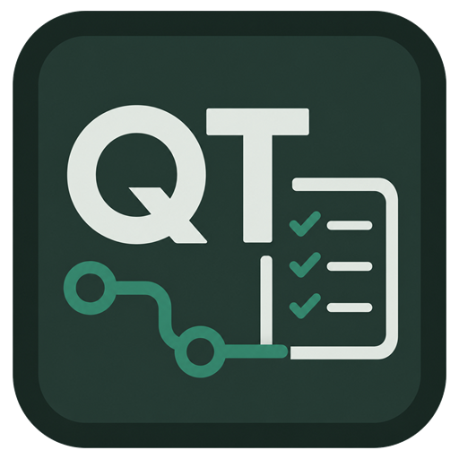

<p align="center">
  
</p>

<h1 align="center">基于 SpringBoot 的产品质量追踪系统</h1>

<p align="center">
  <a href="https://trace.jia4u.de">在线演示</a> ·
  <a href="#公网部署推荐-docker-compose">Docker Compose 部署</a> ·
  <a href="backend/openapi.json">OpenAPI</a>
</p>

数据库综合实践课程设计项目。系统围绕“供应商 -> 原材料批次 -> 生产工单 -> 半成品/成品批次 -> 客户”的质量追踪链路，实现主数据、批次、生产、三级检验、缺陷处置、出货、双向追溯、召回和统计报表。

本工程是前后端联调完成版本，不是静态模板。后端提供真实数据库事务与接口，前端页面通过接口读写 MySQL 演示数据，验证脚本覆盖只读接口、角色权限、关键交互、端到端业务流程和单号并发。

## 演示站点

公网演示地址：[https://trace.jia4u.de](https://trace.jia4u.de)

演示账号见下方“演示账号”章节，所有演示账号密码均为 `123456`。

## 项目结构

```text
backend/   Spring Boot + MyBatis-Plus 后端
frontend/  Vue 3 + Vite + Element Plus 前端
deploy/    Caddy 网关与前端静态站点镜像配置
docs/      需求分析、数据库设计、答辩截图
sql/       MySQL 建表脚本与演示数据
scripts/   数据库重置、接口/前端/E2E 验证脚本
plan/      实现计划与验收记录
```

## 技术栈

| 层级 | 技术 |
| --- | --- |
| 后端 | JDK 21+、Spring Boot 3.5.16、MyBatis-Plus 3.5.16、Druid 1.2.28、JWT、springdoc-openapi |
| 前端 | Vue 3.5.39、Vite 7.3.6、Element Plus 2.14.2、Pinia、vue-router、ECharts 6.1.0 |
| 数据库 | MySQL 8.4，库名 `quality_trace` |

默认端口：

| 服务 | 地址 |
| --- | --- |
| 前端 | `http://localhost:5174/` |
| 后端 | `http://localhost:8081` |
| Swagger | `http://localhost:8081/swagger-ui/index.html` |
| Druid | `http://localhost:8081/druid`，账号 `admin / admin123` |

## 数据库初始化

项目默认连接本机 MySQL：`root / 123456`，数据库名 `quality_trace`。

```powershell
mysql -uroot -p < sql/01-schema.sql
mysql -uroot -p < sql/02-init-data.sql
```

如需让报表、分页、供应商质量排名和缺陷 Pareto 更丰富，可在主线数据之后额外导入扩展数据：

```powershell
mysql -uroot -p < sql/03-extra-report-data.sql
```

也可以在项目根目录执行重置脚本：

```powershell
.\scripts\reset-db.ps1
```

端到端脚本会写入业务数据，演示或截图前建议先重置数据库，保持内置故事线一致。

## 启动后端

```powershell
cd backend
mvn spring-boot:run
```

启动后接口前缀为 `http://localhost:8081/api`。OpenAPI 快照文件位于 `backend/openapi.json`。

## 启动前端

```powershell
cd frontend
npm install
npm run dev
```

Vite 开发服务器固定使用 `5174`，并将 `/api` 代理到 `http://localhost:8081`。

## 公网部署（推荐 Docker Compose）

部署结构：

```text
Caddy        80/443，HTTPS、前端静态文件、/api 反代
Spring Boot  8081，仅 Docker 网络内暴露
MySQL        3306，仅 Docker 网络内暴露，首次启动执行 sql/ 初始化脚本
```

前置条件：域名解析到服务器，服务器开放 `80/tcp`、`443/tcp`，已安装 Docker、Docker Compose v2、Git。

一键部署：

```bash
git clone https://github.com/CPU-JIA/springboot-quality-trace.git
cd springboot-quality-trace
APP_DOMAIN=quality.example.com ACME_EMAIL=admin@example.com ./scripts/deploy-docker.sh
```

其中 `APP_DOMAIN` 改成实际绑定的域名，`ACME_EMAIL` 改成证书通知邮箱。例如本站演示环境使用 `APP_DOMAIN=trace.jia4u.de`。

脚本会生成 `.env`，其中 MySQL/Druid 密码使用 `openssl rand -hex 32`，JWT 密钥使用 `openssl rand -hex 64`。如果需要重建密钥：

```bash
FORCE=1 APP_DOMAIN=quality.example.com ACME_EMAIL=admin@example.com ./scripts/deploy-docker.sh
```

常用命令：

```bash
docker compose ps
docker compose logs -f caddy
docker compose logs -f backend
docker compose up -d --build
docker compose down -v
```

更新部署：

```bash
git pull
docker compose up -d --build
```

重置演示数据库：

```bash
docker compose down -v
docker compose up -d --build
```

数据库备份：

```bash
docker compose exec mysql sh -lc 'mysqldump -uroot -p"$MYSQL_ROOT_PASSWORD" quality_trace' > quality_trace_backup.sql
```

数据库恢复：

```bash
docker compose exec -T mysql sh -lc 'mysql -uroot -p"$MYSQL_ROOT_PASSWORD" quality_trace' < quality_trace_backup.sql
```

## 演示账号

所有账号密码均为 `123456`。

| 账号 | 角色 | 主要权限 |
| --- | --- | --- |
| `admin` | 系统管理员 | 用户、物料、供应商、客户、工序、BOM、工艺路线、检验标准 |
| `zhangsan` | 仓库人员 | 原材料入库、批次台账、成品出货 |
| `lisi` | 生产人员 | 生产工单、领料、工序开工/完工、完工入库 |
| `wangwu` | 质检员 | IQC/IPQC/FQC 检验任务领取与提交、缺陷登记 |
| `zhaoliu` | 质量主管 | 缺陷处置、追溯查询、召回管理、统计报表 |

## 已实现功能

- 登录认证：JWT 登录、用户资料、账号启停与角色菜单过滤。
- 用户管理：分页查询、新增、编辑、删除、启停、重置密码、角色分配。
- 主数据维护：物料、供应商、客户、工序、BOM、工艺路线、检验标准。
- 批次台账：原材料入库、自动生成 IQC 检验任务、批次详情、消耗与出货去向。
- 生产工单：创建工单、按 BOM 领料、工序开工/完工、IPQC 门禁、完工入库、自动生成 FQC 检验任务。
- 检验任务：IQC/IPQC/FQC 任务池、领取、动态检验明细、结论联动批次/工序状态。
- 缺陷管理：批次缺陷、过程缺陷、返工、报废、让步、退货处置。
- 出货管理：合格成品出货、库存原子扣减、客户流向记录。
- 追溯查询：按批次号/批次 ID 查询上游、下游，树图支持缩放、拖动和适配视图。
- 召回管理：按源头批次正向追溯影响面，生成召回明细，跟踪通知、回收和关闭。
- 统计报表：质量看板、合格率趋势、缺陷 Pareto、供应商质量分析。

## 前端页面

前端包含登录页和 11 个业务视图：

```text
质量看板 / 用户管理 / 主数据维护 / 批次台账 / 生产工单 / 检验任务
缺陷管理 / 出货管理 / 追溯查询 / 召回管理 / 统计报表
```

页面语言以中文为主，仅保留 IQC、IPQC、FQC、BOM、JWT、API 等专业缩写。

## 验证命令

基础构建验证：

```powershell
cd backend
mvn -q -DskipTests compile

cd ..\frontend
npm run build
```

后端和前端均运行时，在项目根目录执行：

```powershell
.\scripts\verify-readonly.ps1
.\scripts\verify-frontend-routes.ps1
.\scripts\verify-frontend-permissions.ps1
.\scripts\verify-frontend-interactions.ps1
```

完整写流程验证：

```powershell
.\scripts\verify-e2e-flow.ps1
```

该脚本会重置数据库，创建真实两级生产链，覆盖领料、工序、IPQC/FQC、出货、追溯、召回、审计字段和扣减至 0 后禁止再次出货，默认结束后恢复初始演示数据。

单号并发验证：

```powershell
.\scripts\verify-serial-concurrency.ps1
```

报告截图生成：

```powershell
.\scripts\capture-report-screenshots.ps1
```

截图输出目录：`docs/screenshots/`，已包含质量看板、主数据、批次台账、生产工单、检验任务、缺陷管理、追溯查询、召回管理、统计报表 9 张页面截图。

## 课程文档

- `docs/01-需求分析.md`：项目背景、角色用例、功能需求、核心流程、非功能需求、技术选型。
- `docs/02-数据库设计.md`：ER 模型、关系模式、20 张业务表、技术支撑表、视图、触发器、存储过程、索引与完整性设计。
- `docs/03-答辩清单.md`：演示前检查、推荐演示路线、数据库/后端/前端答辩口径、常见问题回答。
- `docs/04-系统架构图.md`：整体架构、核心业务闭环、追溯数据链路和权限页面关系 Mermaid 图。
- `docs/05-测试与验收报告.md`：测试环境、自动化验收脚本、功能测试用例、前端交互验收和最终结论。
- `docs/06-数据库对象清单.md`：表、视图、触发器、存储过程、关键索引和数据脚本清单。
- `backend/openapi.json`：后端 OpenAPI 快照，可作为接口附录。

## 交付说明

- 端口已调整为前端 `5174`、后端 `8081`。
- 演示数据来自 `sql/02-init-data.sql`，前端页面通过后端接口读取真实数据库。
- 关键列表、远程选择器、分页、图表、弹窗、抽屉和权限菜单均通过接口联调。
- 构建脚本已处理 Vite 大 chunk 和 VueUse 注释警告，`npm run build` 不应再出现这两类非阻塞噪音。
