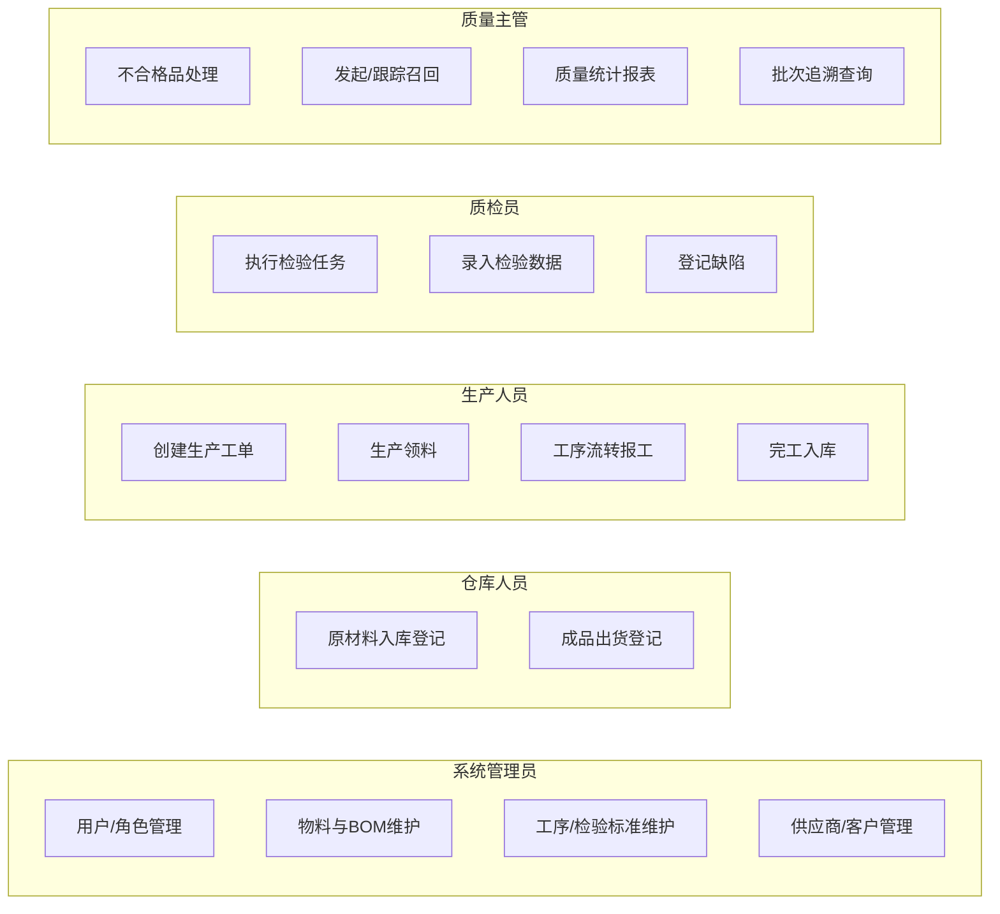
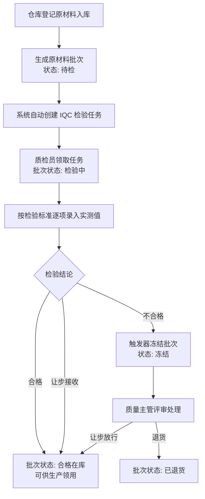
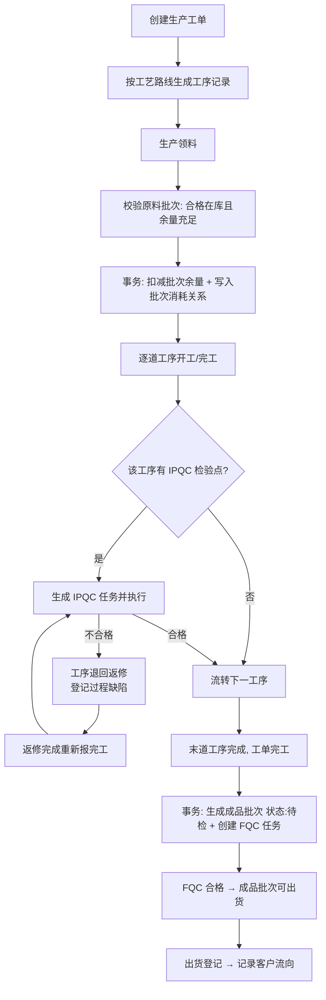
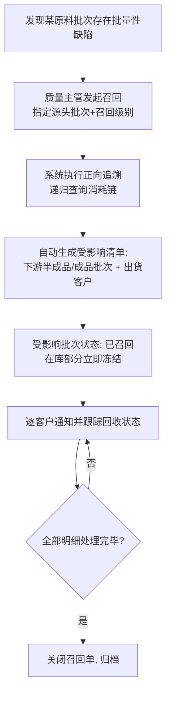

# 需求分析 —— 基于 SpringBoot 的产品质量追踪系统

> 文档版本：v1.1（2026-07-05，经对抗审查修订 IPQC 闭环、返工重检、让步双路径口径）
> 所属阶段：数据库综合实践课程设计 · 需求分析
> 配套文档：[02-数据库设计.md](./02-数据库设计.md)

---

## 1. 项目背景与意义

### 1.1 背景

制造业中，产品质量问题的代价是巨大的：一次批量性缺陷若不能快速定位来源与影响范围，轻则大面积退货返工，重则引发安全事故与全量召回。近年来食品、汽车、消费电子行业的多起召回事件表明，**"出了问题却查不清用了哪批料、流向了哪些客户"** 是企业质量管理的最大痛点。

与此同时，《产品质量法》、ISO 9001 质量管理体系均对产品的**可追溯性（Traceability）**提出明确要求：企业应能对原材料采购、生产过程、检验记录、出货流向进行全程记录，做到**来源可查、去向可追、责任可究**。

传统的纸质台账或 Excel 记录方式存在三个致命缺陷：

1. **追溯链断裂**：原材料批次与成品批次之间的消耗关系没有结构化记录，正反向追溯基本靠人工翻单据；
2. **检验数据孤岛**：来料检验、过程检验、成品检验的记录分散，无法汇总分析质量趋势；
3. **召回响应迟缓**：发现问题原料后，无法在分钟级内计算出受影响的全部成品批次与客户清单。

### 1.2 项目意义

本系统以**批次（Batch）**为追溯基本单元，用关系数据库对"供应商 → 原材料批次 → 生产工单 → 成品批次 → 客户"的完整链路建模，实现：

- **双向追溯**：正向（一批原料流向了哪些成品和客户）与反向（一件成品用了哪些原料、经过哪些工序和检验）；
- **三级检验闭环**：来料检验（IQC）、过程检验（IPQC）、成品检验（FQC）全流程数字化；
- **分钟级召回**：基于追溯链自动计算召回影响面，生成召回明细并跟踪回收进度；
- **质量决策支持**：合格率趋势、缺陷帕累托分析、供应商质量排名等统计报表。

从数据库课程角度，本选题天然覆盖**自关联建模（BOM）、递归查询（追溯链）、多表事务（领料/完工）、状态机约束、触发器、视图、存储过程、索引设计**等核心知识点，是展示数据库设计能力的理想载体。

### 1.3 业务场景设定

为使系统具体可演示，本课设虚构一家小家电制造企业 **"星辉电器"** 作为业务原型，其主打产品为电热水壶：

- **原材料**（外购，需 IQC）：温控器、加热管、食品级不锈钢内胆、外壳塑料粒子、电源线等；
- **半成品**（自制）：壶体组件（外壳塑料粒子经注塑工序成型为外壳，再与不锈钢内胆装配而成——注塑外壳为工序中间产物，不单独建批次管理）；
- **成品**：星辉电热水壶（壶体组件 + 温控器 + 加热管 + 电源线总装而成）；
- **生产工序**：注塑 → 壶体装配 → 总装 → 整机测试 → 包装，其中总装与整机测试环节设 IPQC 检验点；
- **典型质量事件**：某供应商的一批温控器存在触点缺陷，用其生产的两批电热水壶已分别售予两家客户——系统需反向定位问题源头、正向圈定影响范围并发起召回。

该场景为**两级 BOM**（成品 → 半成品 → 原材料，共三层物料节点），足以演示递归追溯，又不至于复杂到失控。

---

## 2. 用户角色与用例

### 2.1 角色定义

| 角色       | 编码              | 职责                                                             |
| ---------- | ----------------- | ---------------------------------------------------------------- |
| 系统管理员 | `ADMIN`           | 用户与角色管理、主数据（物料/BOM/工序/检验标准/供应商/客户）维护 |
| 仓库人员   | `WAREHOUSE`       | 原材料入库登记（生成原材料批次）、成品出货登记                   |
| 生产人员   | `PRODUCTION`      | 创建生产工单、领料、工序流转报工、完工入库                       |
| 质检员     | `INSPECTOR`       | 执行 IQC/IPQC/FQC 检验任务、录入检验数据、登记缺陷               |
| 质量主管   | `QUALITY_MANAGER` | 不合格品处理评审、发起与跟踪召回、查看统计报表                   |

> 设计说明：角色采用经典 RBAC（用户—角色—权限）模型，权限粒度控制到"菜单/功能模块"级别；按 YAGNI 原则不做按钮级权限。

### 2.2 用例图

---

## 3. 功能需求

系统划分为 8 个功能模块：

### 3.1 认证与权限模块

| 编号 | 功能      | 说明                                            |
| ---- | --------- | ----------------------------------------------- |
| F1-1 | 登录/登出 | 账号密码登录，签发 JWT；密码 BCrypt 加密存储；每次请求校验账号仍存在且启用，角色以数据库最新授权为准 |
| F1-2 | 用户管理  | 用户的增删改查、启用/禁用、重置密码（仅管理员） |
| F1-3 | 角色分配  | 为用户分配一个或多个角色，前端按角色渲染菜单    |

### 3.2 主数据管理模块

| 编号 | 功能         | 说明                                                               |
| ---- | ------------ | ------------------------------------------------------------------ |
| F2-1 | 物料管理     | 原材料/半成品/成品统一建模，含编码、规格、单位、保质期             |
| F2-2 | BOM 管理     | 维护物料的父子构成关系及单位用量（自关联，多级）                   |
| F2-3 | 工序管理     | 工序字典 + 各成品的工艺路线（工序顺序）                            |
| F2-4 | 检验标准管理 | 按物料/工序配置检验项目：项目名、类型（定量/定性）、标准值与上下限 |
| F2-5 | 供应商管理   | 供应商档案维护                                                     |
| F2-6 | 客户管理     | 客户档案维护                                                       |

### 3.3 来料与批次模块

| 编号 | 功能       | 说明                                                                           |
| ---- | ---------- | ------------------------------------------------------------------------------ |
| F3-1 | 原材料入库 | 登记供应商、物料、数量，系统按规则生成唯一批次号，批次初始状态"待检"           |
| F3-2 | 批次台账   | 全部批次的查询、筛选（按物料/状态/来源/供应商），查看批次全景信息              |
| F3-3 | 批次状态机 | 待检 → 检验中 → 合格在库 / 冻结 → 已耗尽 / 已报废 / 已退货 / 已召回，状态流转受规则约束；领料或出货扣减至 0 时统一置为"已耗尽" |

### 3.4 生产管理模块

| 编号 | 功能     | 说明                                                                                                                                                             |
| ---- | -------- | ---------------------------------------------------------------------------------------------------------------------------------------------------------------- |
| F4-1 | 生产工单 | 创建工单（生产何物料、计划数量、负责人），按工艺路线自动生成工序记录                                                                                             |
| F4-2 | 生产领料 | 从合格在库的原材料批次中领料，扣减批次剩余量并写入**批次消耗关系**（追溯链的边），多表操作保证事务原子性                                                         |
| F4-3 | 工序流转 | 逐道工序开工/完工报工；设有 IPQC 检验点的工序**报完工时自动生成过程检验任务，IPQC 通过后方可流转下一道工序**；不合格则工序退回返修、登记过程缺陷，复检通过才放行 |
| F4-4 | 完工入库 | 工单完工生成成品批次（初始状态"待检"，等待 FQC），记录实际产量                                                                                                   |

### 3.5 质量检验模块

| 编号 | 功能         | 说明                                                                                                                                                                                                                   |
| ---- | ------------ | ---------------------------------------------------------------------------------------------------------------------------------------------------------------------------------------------------------------------- |
| F5-1 | 检验任务池   | IQC（入库自动生成）/ IPQC（工序完工生成）/ FQC（完工入库生成）任务统一管理与领取                                                                                                                                       |
| F5-2 | 检验执行     | 按检验标准逐项录入实测值（定量自动判定超限，定性人工判定），系统汇总单项结果                                                                                                                                           |
| F5-3 | 检验结论     | 合格 / 不合格 / 让步接收；IQC/FQC **不合格结论自动冻结关联批次**（数据库触发器兜底）；IPQC 不合格走工序返修闭环（见 F4-3）；轻微偏差可直接判"让步接收"但须同步登记缺陷并由质量主管评审留痕，严重偏差必须走冻结评审路径 |
| F5-4 | 缺陷登记     | 检验发现或售后反馈时登记缺陷类型、严重度、数量、描述；缺陷载体双轨——IQC/FQC/售后缺陷挂批次，IPQC 过程缺陷挂工序执行记录（其时成品批次尚未生成）                                                                        |
| F5-5 | 不合格品处理 | 质量主管评审冻结批次：返工 / 报废 / 让步放行 / 退货，处理后批次状态相应流转；**处置为"返工"完成时系统自动生成同类型重检任务**（返工不换料，需换料应另开工单以保持追溯链完整）                                          |

### 3.6 出货与追溯模块

| 编号 | 功能     | 说明                                                                                                        |
| ---- | -------- | ----------------------------------------------------------------------------------------------------------- |
| F6-1 | 成品出货 | 从合格成品批次出货给客户，扣减剩余量，记录流向                                                              |
| F6-2 | 反向追溯 | 输入任一成品/半成品批次号，递归展开其全部上游：消耗的原料批次、供应商、经过的工序与检验记录（追溯树可视化） |
| F6-3 | 正向追溯 | 输入任一原料批次号，递归展开其全部下游：被哪些工单消耗、产出哪些成品批次、出货给哪些客户                    |

### 3.7 召回管理模块

| 编号 | 功能         | 说明                                                                                     |
| ---- | ------------ | ---------------------------------------------------------------------------------------- |
| F7-1 | 发起召回     | 指定问题源头批次与召回级别，系统**基于正向追溯自动计算受影响批次与客户清单**生成召回明细 |
| F7-2 | 召回执行跟踪 | 逐条明细更新回收状态（待通知/已通知/已回收/无法回收），状态只允许向前流转；无法回收必须填写原因，全部明细达到终态后关闭召回单 |
| F7-3 | 批次召回标记 | 被召回批次状态置为"已召回"，冻结一切流转                                                 |

### 3.8 统计分析模块

| 编号 | 功能           | 说明                                                             |
| ---- | -------------- | ---------------------------------------------------------------- |
| F8-1 | 质量总览看板   | 今日待检任务数、在库批次数、本月合格率、进行中召回等核心指标卡片 |
| F8-2 | 合格率趋势     | 按月/按检验类型统计检验合格率折线图                              |
| F8-3 | 缺陷帕累托分析 | 缺陷类型分布柱状图 + 累计占比曲线，定位主要质量问题              |
| F8-4 | 供应商质量排名 | 按供应商统计来料批次 IQC 合格率、缺陷数并排名                    |

---

## 4. 核心业务流程

### 4.1 来料检验流程（IQC）

### 4.2 生产与追溯链构建流程

### 4.3 召回处理流程（体现追溯价值的场景）

---

## 5. 非功能需求

| 类别       | 要求                                                                                                  |
| ---------- | ----------------------------------------------------------------------------------------------------- |
| 数据完整性 | 所有实体间引用以外键约束保证；关键状态流转由应用层校验 + 数据库触发器双重防线                         |
| 事务一致性 | 领料、完工入库、检验提交、召回创建等多表写操作必须原子提交（Spring `@Transactional`，InnoDB 引擎）    |
| 查询性能   | 批次号查询、双向追溯为高频操作，通过唯一索引与消耗关系表双向索引保障；追溯递归深度 ≤ 10 层，响应 < 1s |
| 安全性     | 密码 BCrypt 哈希存储；接口 JWT 鉴权；MyBatis 预编译参数杜绝 SQL 注入；外部输入服务端校验              |
| 可维护性   | 前后端分离；后端分层架构（Controller/Service/Mapper）；代码全量详尽中文注释（课设要求）               |
| 可演示性   | 提供内置演示数据集，含一条完整的"入库→检验→生产→出货→召回"故事线                                      |

---

## 6. 技术选型与版本锁定

> 选版方法：2026-07-04 经官方渠道（spring.io / GitHub Releases / Maven Central / npm registry / MySQL 官网）多源交叉调研后锁定。原则：**最新稳定 GA 优先；大版本发布不足 8 个月且社区资料少则退回上一成熟版本线最新 patch；全部精确到 patch 版本，全组统一，禁止漂移。**

### 6.1 后端与数据库

| 层次      | 选型                                | 锁定版本              | 选择理由与调研结论                                                                                                                                                                                                                                                                                                                  |
| --------- | ----------------------------------- | --------------------- | ----------------------------------------------------------------------------------------------------------------------------------------------------------------------------------------------------------------------------------------------------------------------------------------------------------------------------------- |
| 数据库    | MySQL Community Server              | **8.4.10**（8.4 LTS） | **8.0 线已于 2026-04 终止支持（EOL，最终版 8.0.46），选停服版本是选型硬伤**；8.4 为当前主力 LTS（支持至 2029+），课设所需特性（递归 CTE、外键、触发器、存储过程、`CHECK` 约束）与 8.0 完全同源；9.7 LTS 仅发布 2.5 个月，不选。`cte_max_recursion_depth` 默认 1000，追溯查询余量充足                                                |
| JDBC 驱动 | mysql-connector-j                   | **9.7.0**             | 新坐标 `com.mysql:mysql-connector-j`（老坐标 `mysql:mysql-connector-java` 已停更）；与 Spring Boot 3.5.16 官方托管版本一致，零冲突                                                                                                                                                                                                  |
| 运行环境  | JDK（Eclipse Temurin）              | **21.0.11**（LTS）    | Boot 3.5 支持区间 17～25 的正中位；发布近 3 年生态零坑；Temurin 免费无许可风险（Oracle JDK 17 免费窗口已于 2024-09 结束）；JDK 25 较新部分工具链未跟上，不选                                                                                                                                                                        |
| 构建工具  | Maven                               | **3.9.16**            | 当前最新稳定版（Maven 4 仍在 RC 未 GA）；项目内提交 Maven Wrapper 锁定，验收环境无需预装                                                                                                                                                                                                                                            |
| 后端框架  | Spring Boot                         | **3.5.16**            | 3.x 一代最终形态（2026-06-25 发布，经 16 个 patch 打磨）；**Boot 4.x GA 仅 7.5 个月且含大量破坏性变更（Jackson 3 改包名、starter 模块化），MyBatis-Plus 等生态适配尚在早期，中文资料几乎空白，明确不选**。注：3.5 线 OSS 支持已于 2026-06-30 结束（课设周期不依赖后续补丁，Maven Central 构件永久可用，报告如实注明此背景以示严谨） |
| —         | Spring Framework                    | 6.2.19                | 由 Boot 3.5.16 BOM 托管，pom 不手动声明，禁止混搭 7.x                                                                                                                                                                                                                                                                               |
| ORM       | MyBatis-Plus                        | **3.5.16**            | 单表 CRUD 零 SQL；追溯/统计复杂查询手写 XML SQL 展示数据库能力。**关键坑：Boot 3 必须用 `mybatis-plus-spring-boot3-starter`**（用错 `mybatis-plus-boot-starter` 会报 `factoryBeanObjectType` 错误）；3.5.9+ 分页插件解耦，须额外引 `mybatis-plus-jsqlparser`                                                                        |
| 连接池    | Druid                               | **1.2.28**            | 相比 Boot 默认 HikariCP，内置 `/druid` 监控台（SQL 执行统计、慢 SQL 定位）**与数据库课程主题强相关，答辩演示价值高**。坑：Boot 3 必须用 `druid-spring-boot-3-starter`（Boot 2 版 starter 在 Boot 3 上静默失效）                                                                                                                     |
| 认证      | JWT（自实现拦截器）                 | jjwt **0.13.0**       | 三件套 `jjwt-api`/`jjwt-impl`/`jjwt-jackson`；与 0.12.x API 完全兼容。注意用 0.12+ 新链式 API（`Jwts.parser().verifyWith()`），网上 0.11.x 老教程代码（`parserBuilder`/`setSubject`）编译不过                                                                                                                                       |
| 密码哈希  | spring-security-crypto              | **6.5.11**            | 单独引入即得 `BCryptPasswordEncoder`，不带入 Spring Security 过滤器链；版本与 Boot 3.5.16 托管一致                                                                                                                                                                                                                                  |
| 接口文档  | springdoc-openapi-starter-webmvc-ui | **2.8.17**            | **调研否决了原方案 Knife4j**：其 4.5.0 已停更 2.5 年，配 Boot 3.4/3.5 开箱即抛 `NoSuchMethodError`（GitHub #865/#913 等至今 open）。springdoc 2.8.x 是官方兼容矩阵中 Boot 3.5 的对应线，零配置得 swagger-ui。注意勿引 3.0.x（Boot 4 专用）；Boot 不托管 springdoc 版本，必须显式写                                                  |
| 工具库    | hutool-all                          | **5.8.46**            | 中文文档丰富；`ExcelUtil` 直接支撑报表导出加分项；该版修复 JNDIUtil 漏洞，必须锁定此 patch。与 commons-lang3 二选一，避免两套工具混用（DRY）                                                                                                                                                                                        |
| 代码简化  | Lombok                              | 1.18.46               | 与 Boot 3.5.16 托管版本一致；JDK 21 完全兼容                                                                                                                                                                                                                                                                                        |

### 6.2 前端

| 层次        | 选型         | 锁定版本                  | 选择理由与调研结论                                                                                                                            |
| ----------- | ------------ | ------------------------- | --------------------------------------------------------------------------------------------------------------------------------------------- |
| 运行环境    | Node.js      | **24.18.0**（Active LTS） | 当前 Active LTS "Krypton"；Node 20 已于 2026-04-30 EOL 不可用；Node 26 为 Current 非 LTS 禁用                                                 |
| 前端框架    | Vue          | **3.5.39**                | 3.5 线最新 patch；**Vue 3.6（Vapor Mode）仍在 beta，未 GA，锁死 3.5.39 避开生态动荡**（package.json 去 `^` 前缀）                             |
| 构建工具    | Vite         | **7.3.6**                 | Vite 8（Rolldown 架构大改）GA 仅 3.7 个月，踩坑资料少，按求稳原则退回仍在维护的 7 线最新 patch；要求 Node ≥ 20.19 或 ≥ 22.12，与 Node 24 匹配 |
| 路由        | vue-router   | **4.6.4**                 | v5 GA 仅 5 个月且教程几乎全基于 v4；4.6.4 为 v4 线终版                                                                                        |
| 状态管理    | pinia        | **3.0.4**                 | 3.0 GA 已 17 个月，成熟；API 与 2.x 一致，教程可直接套用                                                                                      |
| UI 组件库   | Element Plus | **2.14.2**                | 当前主力 GA 线最新版；peerDependencies 与 Vue 3.5.39 完全兼容                                                                                 |
| 图表        | ECharts      | **6.1.0**                 | 6.0 GA 已 11 个月跨过成熟线；注意网上教程大量仍是 5.x 写法，默认主题等有差异，查资料认准 6.x                                                  |
| HTTP 客户端 | axios        | **1.18.1**                | 唯一稳定线最新 patch；统一封装拦截器处理 token 与错误提示                                                                                     |

### 6.3 关键取舍说明（Why not）

- **为什么不用 Spring Security**：课设场景仅需"登录 + 角色校验"，Spring Security 的过滤器链对初学者是黑盒，自实现 JWT 拦截器代码量约 200 行且完全透明，答辩更有底气（密码哈希单独借用其 `spring-security-crypto` 模块，不引入过滤器链）；
- **为什么不用 JPA**：JPA 自动生成 SQL 会掩盖数据库能力，与"数据库课程设计"的考察目标相悖；MyBatis-Plus 允许复杂 SQL 显式手写；
- **为什么不用 Spring Boot 4 / Vue 3.6 / Vite 8 等最新大版本**：均发布不足 8 个月，破坏性变更多、周边生态与中文资料未跟上；课设的目标是稳定交付与可讲解性，不是追新（版本生命周期意识本身就是选型论证的加分项）；
- **为什么不单独建库存表**：批次表以"初始数量 + 剩余数量"字段承载库存职能（剩余量 > 0 且状态合格即可用库存），避免批次与库存两套账目的同步问题，详见数据库设计文档的决策章节。

### 6.4 环境统一要求（全组）

- 后端：JDK 21.0.11（Temurin）+ Maven Wrapper（随项目提交，锁 3.9.16）+ MySQL 8.4.10（Windows MSI 内置 MySQL Configurator 向导安装）；
- 前端：Node 24.18.0（建议 nvm-windows 管理）+ 提交 `package-lock.json` 保证依赖可复现；
- 数据库客户端：使用新版工具（DBeaver / MySQL Workbench / Navicat 16+）——**MySQL 8.4 默认禁用 `mysql_native_password` 认证插件，老版本客户端会报认证错误**；
- 严禁混抄 Boot 4.x / Vue 3.6 / ECharts 5.x 教程代码——版本代际差异是网上答案交叉污染的最大坑源。

---

## 7. 系统边界（明确不做什么）

按 YAGNI 原则，以下内容**不在**本课设范围内，避免范围蔓延：

- ❌ 采购订单/销售订单管理（直接从"入库"和"出货"切入，聚焦追溯主链）
- ❌ 财务与成本核算
- ❌ 序列号级（单件）追溯——本系统追溯粒度为**批次级**，这是行业主流做法且数据模型更聚焦
- ❌ SPC 统计过程控制、控制图等高级质量工程工具
- ❌ 多工厂/多仓库/库位管理（仓库位置仅作为批次的一个文本字段）
- ❌ 消息通知（站内信/短信/邮件）
- ❌ 按钮级权限控制（权限到菜单级）
