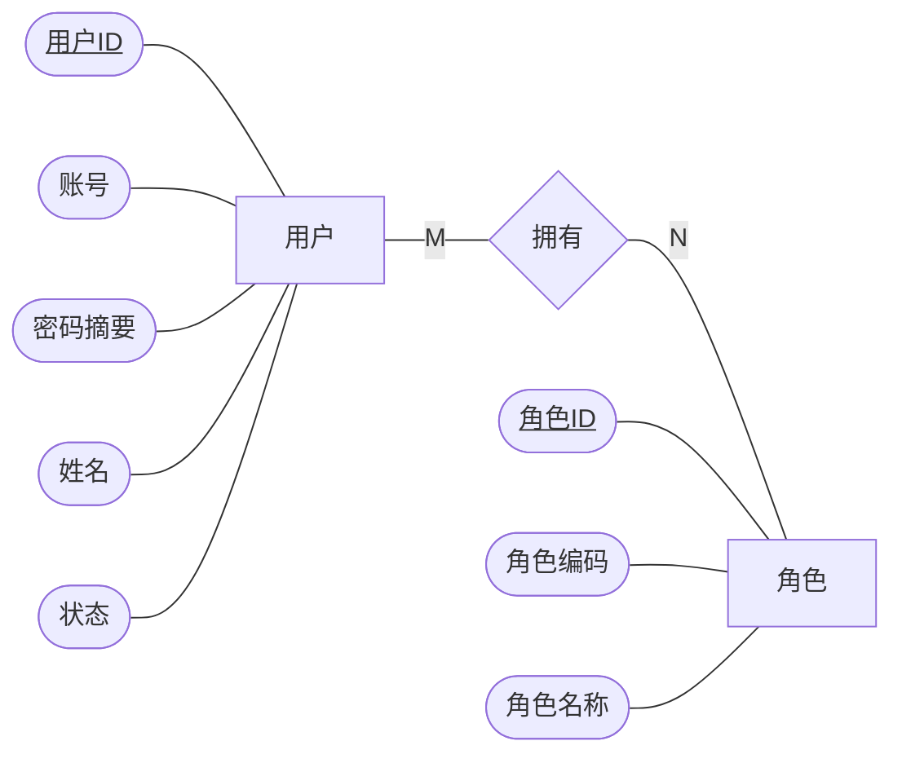
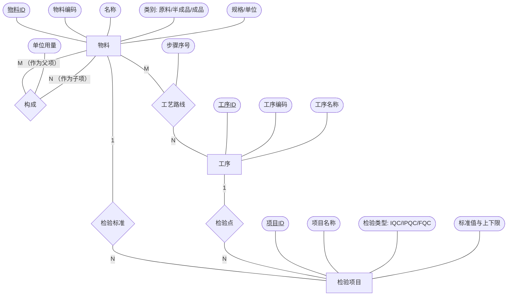
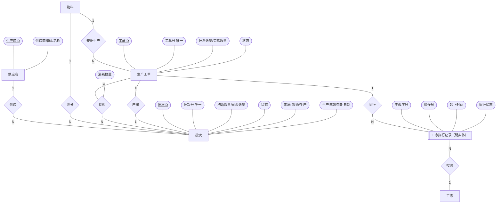
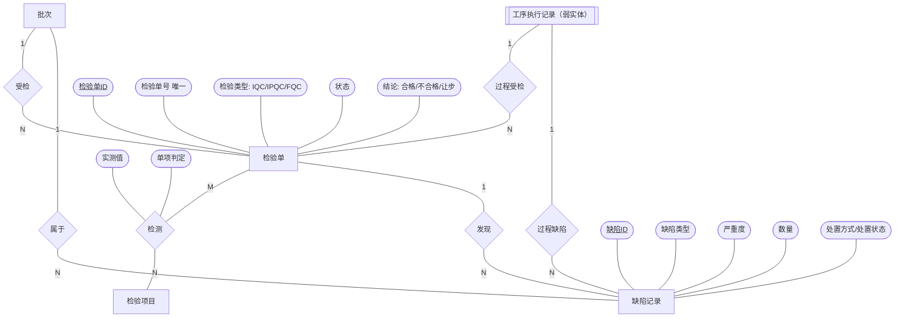
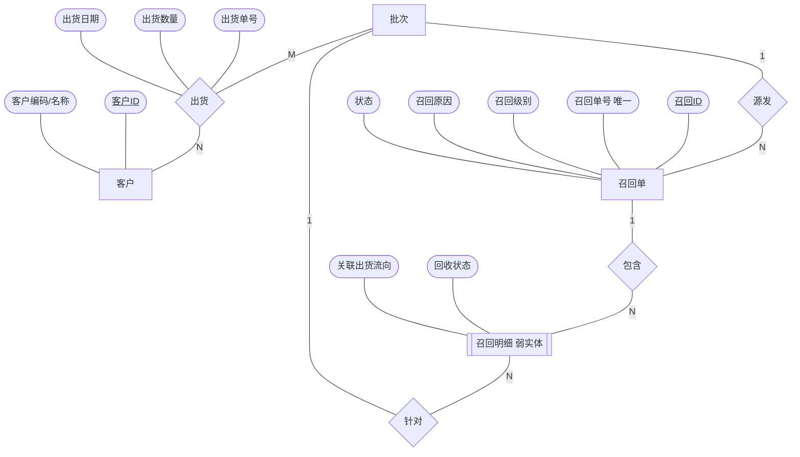
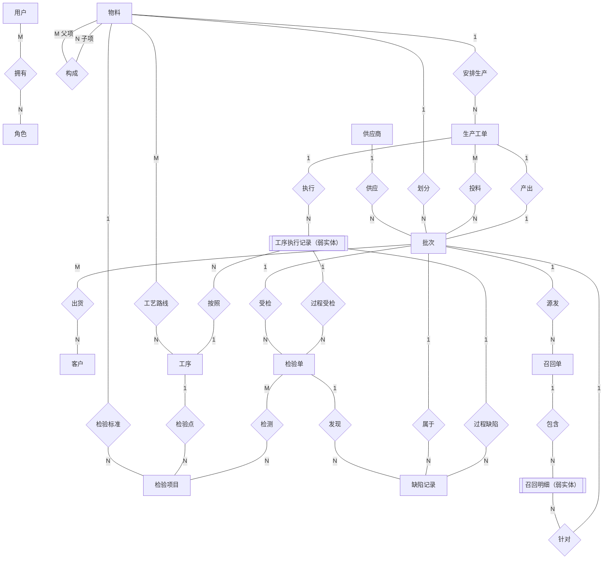
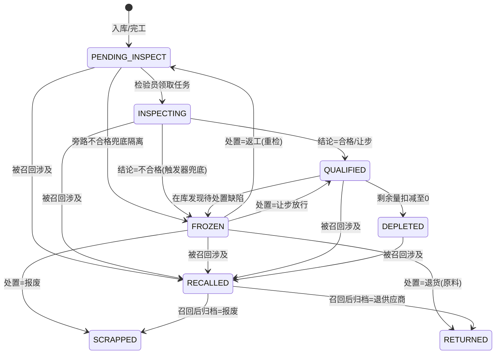

# 数据库设计 —— 基于 SpringBoot 的产品质量追踪系统

> 文档版本：v1.2（2026-07-05。v1.1：4 路对抗审查修订 20 余处；v1.2：阅卷视角复审修订——工序执行记录实体化为弱实体、帕累托改窗口函数频次口径、追溯路径枚举口径申报等 10 处）
> 所属阶段：数据库综合实践课程设计 · 数据库设计
> 设计方法：概念结构设计（Chen 氏 ER 模型）→ 逻辑结构设计（关系模式转换）→ 物理结构设计（MySQL 8.4 DDL）
> 配套脚本：[sql/01-schema.sql](../sql/01-schema.sql)（建库建表）、[sql/02-init-data.sql](../sql/02-init-data.sql)（演示数据）

---

## 1. 设计概述与规范

### 1.1 设计目标

以**批次**为追溯基本单元，对"供应商 → 原材料批次 → 生产工单（工序、检验）→ 成品批次 → 客户"全链路建模。核心设计约束：

1. **追溯链必须结构化**：批次与批次之间的物料消耗关系是一张有向无环图（DAG），必须以边表显式存储，支撑递归查询双向遍历；
2. **质量数据不可篡改删除**：业务单据（批次/检验/召回）只增不删，外键一律 `RESTRICT`；
3. **状态流转受控**：批次、工单、检验单均为有限状态机，非法流转在应用层拦截、关键流转在数据库层以触发器兜底。

### 1.2 命名与字段规范

| 规范项      | 约定                                                                                                                                                                     |
| ----------- | ------------------------------------------------------------------------------------------------------------------------------------------------------------------------ |
| 表名        | 小写下划线；系统表 `sys_` 前缀，业务表无前缀                                                                                                                             |
| 主键        | 统一代理主键 `id BIGINT UNSIGNED AUTO_INCREMENT`（业务码如批次号另设 `UNIQUE` 约束，理由见 §5.1）                                                                        |
| 外键列      | `被引用表名_id`（如 `material_id`）；自关联或语义化场景加语义前缀（如 `parent_material_id`）                                                                             |
| 状态/枚举列 | **多值状态机列**用 `VARCHAR + CHECK` 约束，值用大写蛇形英文（如 `PENDING_INSPECT`），理由见 §5.5；**二值开关列**用 `TINYINT`（1/0），如主数据的 `status` 启用标志        |
| 数量列      | `DECIMAL(12,3)`（支持 kg 等三位小数计量单位）                                                                                                                            |
| 时间列      | `DATETIME`。**业务可变表**标配 `created_at`（默认当前时间）+ `updated_at`（自动更新，审计需要）；**纯追加型关联/明细表**仅 `created_at`（如 BOM 行、检验明细、消耗记录） |
| 字符集      | 库级 `utf8mb4` / `utf8mb4_0900_ai_ci`（MySQL 8 默认，完整支持中文与 emoji）                                                                                              |
| 存储引擎    | 全部 `InnoDB`（事务与外键的前提）                                                                                                                                        |
| 注释        | 每表每列必带 `COMMENT`（课设要求，亦是工程规范）                                                                                                                         |

---

## 2. 概念结构设计（Chen 氏 ER 模型）

### 2.1 设计方法说明

采用教材标准的**视图集成法**：先按业务域分别设计**局部 ER 图**，再消除冲突与冗余，集成为**全局 ER 图**。

绘图记法为 **Chen 氏（陈氏）记法**：

- **矩形** = 实体型；**菱形** = 联系型；**椭圆** = 属性（图中以圆角框绘制，<u>下划线</u>标注主属性/码）；
- 联系两侧连线标注映射基数（1、N、M）；
- **联系自身可以带属性**（如"投料"联系带"消耗数量"），这是 Chen 模型区别于鸟足式记法的关键表达力；
- 为控制图面复杂度，局部图中每个实体仅标注**关键属性**，完整属性清单见 §4 物理结构设计；全局图省略全部属性、省略"经办"类次要联系（以文字说明）。

**图元近似与渲染说明**：受 Mermaid 图元限制，本文以近似图元表达 Chen 记法——椭圆属性以圆角框近似，**弱实体的双线矩形以双边框子程序形 `[[ ]]` 近似**，语义以本图例为准；含冒号/斜杠的节点文本已加引号以保证跨渲染器兼容；主码的<u>下划线</u>依赖 HTML 标签渲染，建议以 Typora / VSCode / mermaid.live 查看或导出图片（GitHub 网页端会剥离该标签，仅影响下划线显示、不影响图形结构）。

本系统概念模型共识别出 **14 个实体型（含 2 个弱实体）、22 个联系型**（另有 7 个"经办"类 1:N 联系为控制图面复杂度以文字说明，见 §2.3）。特别指出四处教材经典建模场景：

1. **BOM（物料构成）是"物料"实体型对自身的 M:N 一元联系**，联系属性为"单位用量"——与教材"零件—构成"经典案例同构；
2. **"出货"建模为"批次"与"客户"之间的 M:N 联系**（带出货单号、数量、日期等属性）。注意它是**可重复发生的事件型联系**：同一（批次，客户）对可多次出货，故转换关系模式时以出货单号为业务标识，而非以两端码组合为候选码——这是对教材 M:N 转换规则的标准变通，详见 §3.1 规则 4 加注；
3. **"投料"（批次消耗）是"生产工单"与"批次"之间的 M:N 联系**——它就是追溯链的"边"，是全系统最核心的一个联系型；
4. **两个弱实体**：**工序执行记录**（依赖生产工单存在，以"工单 + 步骤序号"定位；因 IPQC 检验单与过程缺陷都要引用它，故将其实体化而非建模为工单—工序的 M:N 联系）与**召回明细**（依赖召回单存在，需同时关联受影响批次与出货流向）——弱实体是教材概念的两处典型应用，也使全部物理外键在概念模型中有据可查。

### 2.2 局部 ER 图

#### 2.2.1 权限域

用户与角色为 M:N（一人可兼多角色，一角色可授多人）。



#### 2.2.2 主数据域（物料 / BOM / 工艺 / 检验标准）

- 物料—物料：**构成**（BOM），M:N 自身联系，属性"单位用量"；
- 物料—工序：**工艺路线**，M:N，属性"步骤序号"（某成品的第几道工序）；
- 物料—检验项目：**检验标准**，1:N（每个检验项目隶属于唯一物料的某类检验）；检验项目与工序之间存在可选的**检验点**联系（IPQC 项目挂靠具体工序），1:N 部分参与。



#### 2.2.3 生产与追溯域（核心）

- 供应商—批次：**供应**，1:N（外购批次必有唯一供应商；部分参与——自产批次不参与）；
- 物料—批次：**划分**，1:N（每个批次属于唯一物料）；
- 物料—生产工单：**安排生产**，1:N；
- 生产工单—批次：**投料**，M:N，属性"消耗数量"（一张工单消耗多个原料批次；一个原料批次可供多张工单分用）——**追溯链的边**；
- 生产工单—批次：**产出**，1:1（一张工单完工产出一个成品批次，见 §5.3 决策）；
- 生产工单—工序执行记录：**执行**，1:N（**工序执行记录为弱实体**：依赖工单存在、以"工单 + 步骤序号"定位，工单创建时按工艺路线快照生成）；
- 工序执行记录—工序：**按照**，N:1（每条执行记录按照某一工序定义作业，其属性"步骤序号、操作员、起止时间、执行状态"挂在弱实体上）。



#### 2.2.4 质量检验域

- 批次—检验单：**受检**，1:N（IQC/FQC 针对批次，部分参与）；
- 工序执行记录—检验单：**过程受检**，1:N（IPQC 针对工序执行记录，部分参与。"受检 / 过程受检"二者互斥——即检验单双可空外键方案的概念层表达，见 §5.4）；
- 检验单—检验项目：**检测**，M:N，属性"实测值、单项判定"——检验明细；
- 检验单—缺陷记录：**发现**，1:N（部分参与）；
- 批次—缺陷记录：**属于**，1:N（部分参与）；工序执行记录—缺陷记录：**过程缺陷**，1:N（部分参与。IPQC 过程缺陷发生时成品批次尚未生成，载体为工序执行记录，"属于 / 过程缺陷"互斥，同为双可空外键方案）。



#### 2.2.5 出货与召回域

- 批次—客户：**出货**，M:N，属性"出货单号、出货数量、出货日期"（一批可分售多客户，一客户可购多批；同一批次对同一客户可多次出货——事件型联系，见 §2.1 与 §3.1 加注）；
- 批次—召回单：**源发**，1:N（一张召回单由一个问题源头批次引发）；
- 召回单—召回明细：**包含**，1:N（**召回明细为弱实体**，图中双边框绘制：明细依赖召回单存在，无独立标识意义）；
- 召回明细—批次：**针对**，N:1（每条明细针对一个受影响批次）；
- 召回明细与出货流向的关联：已出货部分逐笔关联出货记录（据此定位客户），在库部分无出货关联——出货记录是"出货"联系的物理承载表，概念图不重复绘制该引用，以文字说明（联系转换所得的关系可被其他关系引用，属逻辑设计层的正常现象）。



### 2.3 全局 ER 图

视图集成说明：五个局部图中，"批次""物料""工序执行记录"等公共实体经属性合并后统一；无命名冲突与结构冲突。"经办"类联系（均为 1:N）为降低图面复杂度不在全局图绘出，统一以文字说明：**用户实体与批次（登记）、生产工单（负责）、工序执行记录（操作）、检验单（执行）、缺陷记录（处置）、出货记录（经办）、召回单（发起）之间各存在一个 1:N 的经办联系，共 7 个，转换时分别落为 `batch.created_by`、`production_order.manager_id`、`process_record.operator_id`、`inspection_task.inspector_id`、`defect_record.handler_id`、`shipment.operator_id`、`recall_order.initiator_id` 外键列——全部 7 个用户外键均有 ER 出处。**



> **追溯链在概念模型中的体现**：`供应(供应商→批次)` → `投料(批次→工单)` → `产出(工单→批次)` → `出货(批次→客户)` 四个联系型首尾相接，构成一条可递归遍历的有向链——这就是"来源可查、去向可追"的模型基础。

---

## 3. 逻辑结构设计（ER 模型 → 关系模式）

### 3.1 转换规则（教材标准规则）

1. **每个实体型** → 一个关系模式，实体的码即关系的码；
2. **1:N 联系** → 合并入 N 端实体对应的关系模式：N 端增加 1 端码作为外键，联系自身属性一并并入（如"供应"落为批次表的 `supplier_id`）；
3. **1:1 联系** → 合并入任一端（本设计将"产出"并入批次端：`batch.production_order_id`，并施加唯一约束体现 1:1）；
4. **M:N 联系** → 独立关系模式，两端码 + 联系属性共同构成，两端码的组合为候选码（工程实现中另设代理主键 `id`，组合列施加 `UNIQUE`，理由见 §5.1）。
   **加注（带序/事件型联系的标准变通）**：两个 M:N 联系的候选码不是两端码组合——**工艺路线**是带序结构，物理候选码为（物料码，步骤序号），同时在应用层约束同一物料路线内不重复选择同一工序，避免工序快照与 IPQC 门禁语义混淆；**出货**是可重复发生的事件（同一批次可多次售予同一客户），故以出货单号为业务标识。其余 M:N 联系（拥有/构成/投料/检测）仍按两端码组合施加 `UNIQUE`；
5. **弱实体** → 独立关系模式，并入其标识实体的码作为外键：**工序执行记录**并入工单码（"执行"落为 `production_order_id`、"按照"落为 `process_def_id`，候选码为（工单码，步骤序号），与工艺路线同为带序结构）；**召回明细**并入召回单码（"包含 / 针对"分别落为 `recall_order_id` / `affected_batch_id`）。

### 3.2 转换结果：20 个业务关系模式 + 1 个技术支撑表

约定：<u>下划线</u>为主码，*斜体*为外码。联系与弱实体转换所得模式已标注来源。`serial_number` 不属于业务 ER 主体，是为并发单号分配引入的技术支撑表。

**由实体型转换（14 个，含 2 个弱实体）：**

| #   | 关系模式                                                                                                                                                                                                                                               | 表名               |
| --- | ------------------------------------------------------------------------------------------------------------------------------------------------------------------------------------------------------------------------------------------------------ | ------------------ |
| 1   | 用户（<u>用户ID</u>，账号，密码摘要，姓名，手机号，状态，……）                                                                                                                                                                                          | `sys_user`         |
| 2   | 角色（<u>角色ID</u>，角色编码，角色名称，描述）                                                                                                                                                                                                        | `sys_role`         |
| 3   | 供应商（<u>供应商ID</u>，编码，名称，联系人，电话，地址，状态，……）                                                                                                                                                                                    | `supplier`         |
| 4   | 客户（<u>客户ID</u>，编码，名称，联系人，电话，地址，状态，……）                                                                                                                                                                                        | `customer`         |
| 5   | 物料（<u>物料ID</u>，编码，名称，类别，规格，单位，保质期天数，状态，……）                                                                                                                                                                              | `material`         |
| 6   | 工序（<u>工序ID</u>，编码，名称，描述，是否IPQC检验点，……）                                                                                                                                                                                            | `process_def`      |
| 7   | 检验项目（<u>项目ID</u>，编码，名称，检验类型，_物料ID_，_工序ID_，是否定量，标准描述，下限，上限，单位，……）〔并入 1:N"检验标准/检验点"〕                                                                                                             | `inspection_item`  |
| 8   | 批次（<u>批次ID</u>，批次号，_物料ID_，来源类型，_供应商ID_，_工单ID_，初始数量，剩余数量，状态，生产日期，到期日期，库位，……）〔并入"划分/供应/产出"〕                                                                                                | `batch`            |
| 9   | 生产工单（<u>工单ID</u>，工单号，_物料ID_，计划数量，实际数量，状态，计划起止，实际起止，_负责人ID_，……）〔并入"安排生产/经办"〕                                                                                                                       | `production_order` |
| 10  | 工序执行记录（<u>ID</u>，_工单ID_，_工序ID_，步骤序号，_操作员ID_，状态，开工时间，完工时间，……）〔弱实体，标识实体=生产工单，**分辨符=步骤序号**（候选码=工单码+步骤序号）；并入"执行/按照/经办"〕                                                    | `process_record`   |
| 11  | 检验单（<u>检验单ID</u>，单号，检验类型，_批次ID_，_工序执行ID_，状态，结论，_检验员ID_，……）〔并入"受检/过程受检/经办"〕                                                                                                                              | `inspection_task`  |
| 12  | 缺陷记录（<u>缺陷ID</u>，缺陷编号，_批次ID_，_工序执行ID_，_检验单ID_，缺陷类型，严重度，数量，描述，处置方式，处置状态，_处置人ID_，……）〔并入"属于/过程缺陷/发现/经办"〕                                                                             | `defect_record`    |
| 13  | 召回单（<u>召回ID</u>，召回单号，_源头批次ID_，级别，原因，状态，_发起人ID_，……）〔并入"源发/经办"〕                                                                                                                                                   | `recall_order`     |
| 14  | 召回明细（<u>ID</u>，_召回单ID_，_受影响批次ID_，_出货记录ID_，回收状态，……）〔弱实体，标识实体=召回单，**分辨符=(受影响批次ID, 出货记录ID)**（候选码=召回单码+分辨符，出货记录空值归一后以函数唯一键强制，见 §4.20）；并入"包含/针对"及出货流向引用〕 | `recall_detail`    |

**由 M:N 联系型转换（6 个）：**

| #   | 关系模式                                                                                | 来源联系         | 表名                |
| --- | --------------------------------------------------------------------------------------- | ---------------- | ------------------- |
| 15  | 用户角色（<u>ID</u>，_用户ID_，_角色ID_）                                               | 拥有             | `sys_user_role`     |
| 16  | 物料清单（<u>ID</u>，_父物料ID_，_子物料ID_，单位用量）                                 | 构成（自身联系） | `bom`               |
| 17  | 工艺路线（<u>ID</u>，_物料ID_，_工序ID_，步骤序号）                                     | 工艺路线（带序） | `process_route`     |
| 18  | 批次消耗（<u>ID</u>，_工单ID_，_消耗批次ID_，消耗数量）                                 | 投料 ★追溯链的边 | `batch_consumption` |
| 19  | 检验记录（<u>ID</u>，_检验单ID_，_检验项目ID_，实测值，结果描述，单项判定，……）         | 检测             | `inspection_record` |
| 20  | 出货记录（<u>ID</u>，出货单号，_批次ID_，_客户ID_，出货数量，出货日期，_经办人ID_，……） | 出货（事件型）   | `shipment`          |

**技术支撑表（1 个）：**

| #   | 关系模式                                         | 用途                 | 表名            |
| --- | ------------------------------------------------ | -------------------- | --------------- |
| T1  | 单号流水（<u>单号前缀</u>，当前已分配序号，……） | 并发下业务单号原子分配 | `serial_number` |

### 3.3 规范化分析

- 所有关系模式的非主属性均**完全函数依赖**于码（无部分依赖，满足 2NF）；
- 不存在未经申报的非主属性对码的**传递依赖**（如批次表中不冗余存储"物料名称"，需要时联接 `material` 获取），满足 **3NF**；
- **有意保留的受控冗余与派生值，全部申报如下**（受控冗余是工程与规范化之间的显式权衡，逐一说明保障机制才是严谨做法）：

| 列                                                    | 性质                             | 保留理由                                                       | 一致性保障                                                                         |
| ----------------------------------------------------- | -------------------------------- | -------------------------------------------------------------- | ---------------------------------------------------------------------------------- |
| `batch.remaining_quantity`                            | 计算冗余（初始量−消耗−出货）     | 高频校验字段，每次领料/出货都要判断余量                        | 事务内 `UPDATE ... WHERE remaining_quantity >= ?` 原子扣减 + `CHECK` 双界，见 §5.2 |
| `batch.expire_date`                                   | 派生快照（生产日期+物料保质期）  | 物料保质期日后可改，批次到期日不应随之漂移——**判定时点快照**   | 入库时应用层一次性计算写入，此后只读                                               |
| `inspection_record.is_pass`（定量项）                 | 派生快照（实测值 vs 项目上下限） | 检验标准日后可修订，历史判定结论不应随之漂移——**判定时点快照** | 录入时应用层按当时限值判定写入，此后只读                                           |
| `defect_record.batch_id`（当检验单非空时）            | 可推导冗余（检验单已含批次）     | 人工/售后登记的缺陷无检验单，批次列必须独立存在，故统一保留    | 应用层校验：登记时若填检验单则批次必须与之一致                                     |
| `recall_detail.affected_batch_id`（当出货记录非空时） | 可推导冗余（出货记录已含批次）   | 在库明细无出货记录，批次列必须独立存在，故统一保留             | 明细由召回服务从追溯结果生成，应用层保证一致                                       |

---

## 4. 物理结构设计（表结构）

> 完整可执行 DDL 见 [sql/01-schema.sql](../sql/01-schema.sql)（含全部 COMMENT、约束、索引、视图、触发器、存储过程）。本节给出逐表说明；类型未注明处：主键均为 `BIGINT UNSIGNED AUTO_INCREMENT`；`created_at`/`updated_at`（配置见 §1.2 时间列分级规范）与各业务表标配的 `remark` 备注列自动维护/含义自明，表格中不再重复列出。

### 4.1 `sys_user` 用户表

| 列        | 类型            | 约束               | 说明                      |
| --------- | --------------- | ------------------ | ------------------------- |
| id        | BIGINT UNSIGNED | PK                 | 用户ID                    |
| username  | VARCHAR(50)     | UNIQUE, NOT NULL   | 登录账号                  |
| password  | VARCHAR(100)    | NOT NULL           | BCrypt 密码摘要（60字符） |
| real_name | VARCHAR(50)     | NOT NULL           | 姓名                      |
| phone     | VARCHAR(20)     |                    | 手机号                    |
| status    | TINYINT         | NOT NULL DEFAULT 1 | 1=启用 0=禁用             |

### 4.2 `sys_role` 角色表

| 列          | 类型            | 约束             | 说明                                                             |
| ----------- | --------------- | ---------------- | ---------------------------------------------------------------- |
| id          | BIGINT UNSIGNED | PK               | 角色ID                                                           |
| role_code   | VARCHAR(30)     | UNIQUE, NOT NULL | 角色编码（ADMIN/WAREHOUSE/PRODUCTION/INSPECTOR/QUALITY_MANAGER） |
| role_name   | VARCHAR(50)     | NOT NULL         | 角色名称                                                         |
| description | VARCHAR(200)    |                  | 职责描述                                                         |

### 4.3 `sys_user_role` 用户角色关联表

| 列      | 类型            | 约束                     | 说明       |
| ------- | --------------- | ------------------------ | ---------- |
| id      | BIGINT UNSIGNED | PK                       |            |
| user_id | BIGINT UNSIGNED | FK→sys_user, NOT NULL    |            |
| role_id | BIGINT UNSIGNED | FK→sys_role, NOT NULL    |            |
| —       |                 | UNIQUE(user_id, role_id) | 防重复授权 |

### 4.4 `supplier` 供应商表 / 4.5 `customer` 客户表

结构对称：`id`、`supplier_code`/`customer_code`（UNIQUE）、`name`、`contact_person`、`phone`、`address`、`status`。

应用层补充校验：新增供应商/客户时服务端强制默认启用；编辑时必须显式提交 `status`（0/1），避免漏传字段把启停状态写成空值或落入数据库异常兜底。

### 4.6 `material` 物料表

| 列              | 类型            | 约束                                        | 说明                    |
| --------------- | --------------- | ------------------------------------------- | ----------------------- |
| id              | BIGINT UNSIGNED | PK                                          | 物料ID                  |
| material_code   | VARCHAR(30)     | UNIQUE, NOT NULL                            | 物料编码（如 RM-001）   |
| name            | VARCHAR(100)    | NOT NULL                                    | 物料名称                |
| category        | VARCHAR(10)     | NOT NULL, CHECK IN ('RAW','SEMI','PRODUCT') | 原材料/半成品/成品      |
| spec            | VARCHAR(100)    |                                             | 规格型号                |
| unit            | VARCHAR(10)     | NOT NULL                                    | 计量单位（个/kg/m）     |
| shelf_life_days | INT UNSIGNED    |                                             | 保质期天数（NULL=不限） |
| status          | TINYINT         | NOT NULL DEFAULT 1                          | 1=启用 0=停用           |

应用层补充校验：新增物料时服务端强制默认启用；编辑时必须显式提交 `status`（0/1）。若从启用改为停用，还要先校验该物料无待检、检验中、合格在库或冻结批次，防止在库业务流程悬空。

### 4.7 `bom` 物料清单表（自关联 M:N）

| 列                 | 类型            | 约束                                       | 说明                        |
| ------------------ | --------------- | ------------------------------------------ | --------------------------- |
| id                 | BIGINT UNSIGNED | PK                                         |                             |
| parent_material_id | BIGINT UNSIGNED | FK→material, NOT NULL                      | 父项物料（半成品/成品）     |
| child_material_id  | BIGINT UNSIGNED | FK→material, NOT NULL                      | 子项物料                    |
| quantity           | DECIMAL(12,3)   | NOT NULL, CHECK > 0                        | 生产 1 单位父项所需子项数量 |
| —                  |                 | UNIQUE(parent, child)；CHECK(parent≠child) | 防重复行与自引用            |

应用层在落库前补充校验：父项必须为启用的半成品/成品，子项必须为启用的原材料/半成品；同一父子项重复新增给出明确中文业务提示；跨层环（如 A→B→C→A）通过 DFS 检测并拒绝。由于工单领料与完工校验按当前 BOM 计算，若父项物料已有状态未 `CLOSED` 的生产工单，系统拒绝新增或删除该父项 BOM 行，避免在制工单的用料需求口径漂移。

### 4.8 `process_def` 工序定义表

| 列           | 类型            | 约束               | 说明                            |
| ------------ | --------------- | ------------------ | ------------------------------- |
| id           | BIGINT UNSIGNED | PK                 |                                 |
| process_code | VARCHAR(30)     | UNIQUE, NOT NULL   | 工序编码                        |
| process_name | VARCHAR(50)     | NOT NULL           | 工序名称（注塑/总装/整机测试…） |
| need_ipqc    | TINYINT         | NOT NULL DEFAULT 0 | 该工序是否为 IPQC 检验点        |
| description  | VARCHAR(200)    |                    | 作业说明                        |

应用层补充校验：`need_ipqc` 一旦发生变化，会影响未关闭工单的后续报工、IPQC 任务生成与门禁校验；因此若 `process_record` 中已有该工序且所属生产工单状态尚未 `CLOSED`，系统拒绝修改该开关，避免在制工单的质量控制口径被主数据漂移改变。

### 4.9 `process_route` 工艺路线表

| 列             | 类型            | 约束                         | 说明                  |
| -------------- | --------------- | ---------------------------- | --------------------- |
| id             | BIGINT UNSIGNED | PK                           |                       |
| material_id    | BIGINT UNSIGNED | FK→material, NOT NULL        | 成品/半成品物料       |
| process_def_id | BIGINT UNSIGNED | FK→process_def, NOT NULL     | 工序                  |
| step_no        | INT UNSIGNED    | NOT NULL                     | 步骤序号（从 1 递增） |
| —              |                 | UNIQUE(material_id, step_no) | 同一物料工序顺序唯一  |

应用层在整条替换保存时补充校验：物料必须启用且为半成品/成品；步骤号必须从 1 连续递增；同一条路线中工序不得重复；末道工序不得为 IPQC 检验点，避免完工入库先于过程检验结论发生。

### 4.10 `inspection_item` 检验项目表

| 列                        | 类型            | 约束                                    | 说明                                 |
| ------------------------- | --------------- | --------------------------------------- | ------------------------------------ |
| id                        | BIGINT UNSIGNED | PK                                      |                                      |
| item_code                 | VARCHAR(30)     | UNIQUE, NOT NULL                        | 项目编码                             |
| item_name                 | VARCHAR(100)    | NOT NULL                                | 项目名称（触点电阻/耐压测试…）       |
| inspect_type              | VARCHAR(10)     | NOT NULL, CHECK IN ('IQC','IPQC','FQC') | 检验类型                             |
| material_id               | BIGINT UNSIGNED | FK→material, NOT NULL                   | 适用物料                             |
| process_def_id            | BIGINT UNSIGNED | FK→process_def, NULL                    | IPQC 时挂靠工序，IQC/FQC 为 NULL     |
| is_quantitative           | TINYINT         | NOT NULL                                | 1=定量（数值判限）0=定性（人工判定） |
| standard_desc             | VARCHAR(200)    | NOT NULL                                | 检验标准描述                         |
| lower_limit / upper_limit | DECIMAL(12,3)   |                                         | 定量项上下限（可单边）               |
| unit                      | VARCHAR(10)     |                                         | 计量单位                             |

应用层补充校验：所有自动生成检验任务的入口都会先确认对应标准项已配置。采购入库前校验该原材料存在 IQC 项；生产工单创建时校验生产物料存在 FQC 项，并校验路线中每个 IPQC 工序存在对应 IPQC 项；工序报完工与完工入库前会再次复查对应标准项，避免主数据被删除后生成无法提交的空检验任务。由于检验任务提交时按当前标准项拉取应检项目与判限，若同一物料/检验类型/IPQC工序已有待检或检验中任务，系统拒绝新增、编辑或删除对应检验标准，并通过物料行锁串行化任务生成与标准维护，避免在途任务校验口径漂移。

### 4.11 `batch` 批次表（追溯基本单元 ★）

| 列                  | 类型            | 约束                                         | 说明                                  |
| ------------------- | --------------- | -------------------------------------------- | ------------------------------------- |
| id                  | BIGINT UNSIGNED | PK                                           | 批次ID                                |
| batch_no            | VARCHAR(30)     | UNIQUE, NOT NULL                             | 批次号（RM/SF/FP-yyyyMMdd-序号）      |
| material_id         | BIGINT UNSIGNED | FK→material, NOT NULL                        | 所属物料                              |
| source_type         | VARCHAR(10)     | NOT NULL, CHECK IN ('PURCHASE','PRODUCTION') | 来源：采购/生产                       |
| supplier_id         | BIGINT UNSIGNED | FK→supplier, NULL                            | 采购来源供应商                        |
| production_order_id | BIGINT UNSIGNED | FK→production_order, NULL, **UNIQUE**        | 产出工单（UNIQUE 体现 1:1"产出"联系） |
| quantity            | DECIMAL(12,3)   | NOT NULL, CHECK > 0                          | 初始数量                              |
| remaining_quantity  | DECIMAL(12,3)   | NOT NULL, CHECK ≥ 0                          | 剩余数量（受控冗余，见 §5.2）         |
| status              | VARCHAR(20)     | NOT NULL, CHECK（8 值状态机）                | 见 §5.6 状态机                        |
| production_date     | DATE            | NOT NULL                                     | 生产/入库日期                         |
| expire_date         | DATE            |                                              | 到期日期（由保质期推算）              |
| warehouse_location  | VARCHAR(50)     |                                              | 库位（简化为文本）                    |
| created_by          | BIGINT UNSIGNED | FK→sys_user                                  | 登记人                                |
| remark              | VARCHAR(500)    |                                              | 备注                                  |

表级约束：`CHECK ((source_type='PURCHASE' AND supplier_id IS NOT NULL AND production_order_id IS NULL) OR (source_type='PRODUCTION' AND production_order_id IS NOT NULL AND supplier_id IS NULL))` —— 来源与外键互斥性由数据库直接保证。

### 4.12 `production_order` 生产工单表

| 列                                  | 类型            | 约束                                                              | 说明                       |
| ----------------------------------- | --------------- | ----------------------------------------------------------------- | -------------------------- |
| id                                  | BIGINT UNSIGNED | PK                                                                |                            |
| order_no                            | VARCHAR(30)     | UNIQUE, NOT NULL                                                  | 工单号（MO-yyyyMMdd-序号） |
| material_id                         | BIGINT UNSIGNED | FK→material, NOT NULL                                             | 生产物料（SEMI/PRODUCT）   |
| plan_quantity                       | DECIMAL(12,3)   | NOT NULL, CHECK > 0                                               | 计划数量                   |
| actual_quantity                     | DECIMAL(12,3)   |                                                                   | 实际完工数量               |
| status                              | VARCHAR(20)     | NOT NULL, CHECK IN ('CREATED','IN_PROGRESS','COMPLETED','CLOSED') | 状态机见 §5.6              |
| plan_start_date / plan_end_date     | DATE            | NOT NULL                                                          | 计划起止                   |
| actual_start_time / actual_end_time | DATETIME        |                                                                   | 实际起止                   |
| manager_id                          | BIGINT UNSIGNED | FK→sys_user, NOT NULL                                             | 负责人                     |
| remark                              | VARCHAR(500)    |                                                                   | 备注                       |

### 4.13 `batch_consumption` 批次消耗表（追溯链的边 ★★）

| 列                  | 类型            | 约束                                           | 说明                         |
| ------------------- | --------------- | ---------------------------------------------- | ---------------------------- |
| id                  | BIGINT UNSIGNED | PK                                             |                              |
| production_order_id | BIGINT UNSIGNED | FK→production_order, NOT NULL                  | 消耗方工单                   |
| consumed_batch_id   | BIGINT UNSIGNED | FK→batch, NOT NULL                             | 被消耗批次                   |
| quantity            | DECIMAL(12,3)   | NOT NULL, CHECK > 0                            | 消耗数量                     |
| —                   |                 | UNIQUE(production_order_id, consumed_batch_id) | 同工单对同批次的消耗合并记录 |

> 追溯语义：成品批次 →（`batch.production_order_id`）→ 工单 →（本表）→ 原料批次。递归组合这两跳即可无限层级上/下游遍历，SQL 见 §6.1。

### 4.14 `process_record` 工序执行记录表

| 列                    | 类型            | 约束                                                     | 说明                                                               |
| --------------------- | --------------- | -------------------------------------------------------- | ------------------------------------------------------------------ |
| id                    | BIGINT UNSIGNED | PK                                                       |                                                                    |
| production_order_id   | BIGINT UNSIGNED | FK→production_order, NOT NULL                            | 所属工单                                                           |
| process_def_id        | BIGINT UNSIGNED | FK→process_def, NOT NULL                                 | 工序                                                               |
| step_no               | INT UNSIGNED    | NOT NULL                                                 | 执行顺序（复制自工艺路线，工单创建时快照，防路线后续变更破坏历史） |
| status                | VARCHAR(20)     | NOT NULL, CHECK IN ('PENDING','IN_PROGRESS','COMPLETED') | 执行状态                                                           |
| operator_id           | BIGINT UNSIGNED | FK→sys_user, NULL                                        | 操作员（开工时记录）                                               |
| start_time / end_time | DATETIME        |                                                          | 实际起止                                                           |
| —                     |                 | UNIQUE(production_order_id, step_no)                     |                                                                    |

### 4.15 `inspection_task` 检验单表

| 列                         | 类型            | 约束                                                     | 说明                         |
| -------------------------- | --------------- | -------------------------------------------------------- | ---------------------------- |
| id                         | BIGINT UNSIGNED | PK                                                       |                              |
| task_no                    | VARCHAR(30)     | UNIQUE, NOT NULL                                         | 检验单号（QC-yyyyMMdd-序号） |
| inspect_type               | VARCHAR(10)     | NOT NULL, CHECK IN ('IQC','IPQC','FQC')                  | 检验类型                     |
| batch_id                   | BIGINT UNSIGNED | FK→batch, NULL                                           | 受检批次（IQC/FQC 必填）     |
| process_record_id          | BIGINT UNSIGNED | FK→process_record, NULL                                  | 受检工序执行（IPQC 必填）    |
| status                     | VARCHAR(20)     | NOT NULL, CHECK IN ('PENDING','IN_PROGRESS','COMPLETED') | 任务状态                     |
| conclusion                 | VARCHAR(20)     | NULL, CHECK IN ('QUALIFIED','UNQUALIFIED','CONCESSION')  | 结论（完成时必填）           |
| inspector_id               | BIGINT UNSIGNED | FK→sys_user, NULL                                        | 检验员（领取时记录）         |
| assigned_at / completed_at | DATETIME        |                                                          | 领取/完成时间                |

表级约束（与 DDL 严格一致）：
`CHECK ((inspect_type IN ('IQC','FQC') AND batch_id IS NOT NULL AND process_record_id IS NULL) OR (inspect_type='IPQC' AND process_record_id IS NOT NULL AND batch_id IS NULL))` —— 检验对象完整互斥（不仅要求"该填的非空"，也要求"不该填的必空"）；
`CHECK (status <> 'COMPLETED' OR conclusion IS NOT NULL)` —— "完成必有结论"由数据库直接保证，防止无结论的已完成单静默绕过冻结触发器。

### 4.16 `inspection_record` 检验记录明细表

| 列                 | 类型            | 约束                                           | 说明                                              |
| ------------------ | --------------- | ---------------------------------------------- | ------------------------------------------------- |
| id                 | BIGINT UNSIGNED | PK                                             |                                                   |
| inspection_task_id | BIGINT UNSIGNED | FK→inspection_task, NOT NULL                   | 所属检验单                                        |
| inspection_item_id | BIGINT UNSIGNED | FK→inspection_item, NOT NULL                   | 检验项目                                          |
| measured_value     | DECIMAL(12,3)   | NULL                                           | 实测值（定量项）                                  |
| result_desc        | VARCHAR(200)    |                                                | 结果描述（定性项）                                |
| is_pass            | TINYINT         | NOT NULL                                       | 单项判定 1=合格 0=不合格（判定时点快照，见 §3.3） |
| inspected_at       | DATETIME        | NOT NULL DEFAULT NOW                           | 检验时间                                          |
| —                  |                 | UNIQUE(inspection_task_id, inspection_item_id) | 一单一项一条记录                                  |

### 4.17 `defect_record` 缺陷记录表

| 列                 | 类型            | 约束                                                                      | 说明                                                    |
| ------------------ | --------------- | ------------------------------------------------------------------------- | ------------------------------------------------------- |
| id                 | BIGINT UNSIGNED | PK                                                                        |                                                         |
| defect_no          | VARCHAR(30)     | UNIQUE, NOT NULL                                                          | 缺陷编号（DF-yyyyMMdd-序号）                            |
| batch_id           | BIGINT UNSIGNED | FK→batch, NULL                                                            | 所属批次（IQC/FQC/售后缺陷填写）                        |
| process_record_id  | BIGINT UNSIGNED | FK→process_record, NULL                                                   | 所属工序执行（IPQC 过程缺陷填写：此时成品批次尚未生成） |
| inspection_task_id | BIGINT UNSIGNED | FK→inspection_task, NULL                                                  | 发现于哪次检验（人工巡检/售后登记时为 NULL）            |
| defect_type        | VARCHAR(20)     | NOT NULL, CHECK IN ('APPEARANCE','DIMENSION','FUNCTION','SAFETY','OTHER') | 外观/尺寸/功能/安全/其他                                |
| severity           | VARCHAR(10)     | NOT NULL, CHECK IN ('CRITICAL','MAJOR','MINOR')                           | 严重度                                                  |
| quantity           | DECIMAL(12,3)   | NOT NULL, CHECK > 0                                                       | 缺陷数量                                                |
| description        | VARCHAR(500)    | NOT NULL                                                                  | 缺陷描述                                                |
| handle_method      | VARCHAR(20)     | NULL, CHECK IN ('REWORK','SCRAP','CONCESSION','RETURN')                   | 处置方式：返工/报废/让步/退货                           |
| handle_status      | VARCHAR(20)     | NOT NULL DEFAULT 'PENDING', CHECK IN ('PENDING','COMPLETED')              | 处置状态                                                |
| handler_id         | BIGINT UNSIGNED | FK→sys_user, NULL                                                         | 处置人（质量主管）                                      |
| handled_at         | DATETIME        |                                                                           | 处置时间                                                |

表级约束：`CHECK (batch_id IS NOT NULL OR process_record_id IS NOT NULL)` —— 缺陷载体（批次/工序执行）至少其一非空，与检验单同款双可空外键方案（DRY），解决"IPQC 过程缺陷发生时成品批次尚未生成"的时序问题（见 §5.4）。

### 4.18 `shipment` 出货记录表

| 列          | 类型            | 约束                  | 说明                          |
| ----------- | --------------- | --------------------- | ----------------------------- |
| id          | BIGINT UNSIGNED | PK                    |                               |
| shipment_no | VARCHAR(30)     | UNIQUE, NOT NULL      | 出货单号（SH-yyyyMMdd-序号）  |
| batch_id    | BIGINT UNSIGNED | FK→batch, NOT NULL    | 出货批次（须 QUALIFIED 成品） |
| customer_id | BIGINT UNSIGNED | FK→customer, NOT NULL | 客户                          |
| quantity    | DECIMAL(12,3)   | NOT NULL, CHECK > 0   | 出货数量                      |
| ship_date   | DATE            | NOT NULL              | 出货日期                      |
| operator_id | BIGINT UNSIGNED | FK→sys_user, NOT NULL | 经办人                        |

### 4.19 `recall_order` 召回单表

| 列              | 类型            | 约束                                                     | 说明                         |
| --------------- | --------------- | -------------------------------------------------------- | ---------------------------- |
| id              | BIGINT UNSIGNED | PK                                                       |                              |
| recall_no       | VARCHAR(30)     | UNIQUE, NOT NULL                                         | 召回单号（RC-yyyyMMdd-序号） |
| source_batch_id | BIGINT UNSIGNED | FK→batch, NOT NULL                                       | 问题源头批次                 |
| recall_level    | VARCHAR(10)     | NOT NULL, CHECK IN ('I','II','III')                      | 召回级别（I 最严重）         |
| reason          | VARCHAR(500)    | NOT NULL                                                 | 召回原因                     |
| status          | VARCHAR(20)     | NOT NULL, CHECK IN ('CREATED','IN_PROGRESS','COMPLETED') | 状态                         |
| initiator_id    | BIGINT UNSIGNED | FK→sys_user, NOT NULL                                    | 发起人（质量主管）           |
| completed_at    | DATETIME        |                                                          | 完成时间                     |

### 4.20 `recall_detail` 召回明细表

| 列                | 类型            | 约束                                                                                    | 说明                                            |
| ----------------- | --------------- | --------------------------------------------------------------------------------------- | ----------------------------------------------- |
| id                | BIGINT UNSIGNED | PK                                                                                      |                                                 |
| recall_order_id   | BIGINT UNSIGNED | FK→recall_order, NOT NULL                                                               | 所属召回单                                      |
| affected_batch_id | BIGINT UNSIGNED | FK→batch, NOT NULL                                                                      | 受影响批次（正向追溯计算所得；受控冗余见 §3.3） |
| shipment_id       | BIGINT UNSIGNED | FK→shipment, NULL                                                                       | 关联出货记录（已出货部分；在库部分为 NULL）     |
| recovery_status   | VARCHAR(20)     | NOT NULL DEFAULT 'PENDING', CHECK IN ('PENDING','NOTIFIED','RECOVERED','UNRECOVERABLE') | 回收状态                                        |
| —                 |                 | UNIQUE(recall_order_id, affected_batch_id, **(COALESCE(shipment_id,0))**)               | 防重复明细（函数唯一键）                        |

> **函数唯一键说明**：InnoDB 唯一索引不判 NULL 相等——若直接以可空的 `shipment_id` 参与唯一键，"在库明细"（shipment_id 为 NULL）可无限重复插入。以 `COALESCE(shipment_id, 0)` 函数键（MySQL 8.0.13+）将 NULL 归一为 0 后，在库明细同样受唯一约束保护。回收粒度为"出货单/在库整批"二值状态，不做数量级回收跟踪（有意简化，YAGNI——监管按量口径可由关联出货数量聚合得出）。

> **回收状态机说明**：召回明细只允许单向推进：`PENDING → NOTIFIED → RECOVERED/UNRECOVERABLE`，在库隔离明细可由 `PENDING` 直接进入终态；终态不可回退。`UNRECOVERABLE` 表示已消费、灭失或客户拒绝回收，必须填写原因说明，便于质量审计复核。

> **并发控制说明**：召回明细更新与召回单关闭均在事务内按"召回单 → 召回明细"顺序执行 `FOR UPDATE` 行锁。关闭召回单前锁定全部明细并复核均为终态；召回单一旦 `COMPLETED`，明细更新接口拒绝再改，避免并发操作把已归档召回单的回收状态改写。

### 4.21 `serial_number` 单号流水表（技术支撑）

| 列            | 类型         | 约束           | 说明                                      |
| ------------- | ------------ | -------------- | ----------------------------------------- |
| serial_key    | VARCHAR(30)  | PK             | 单号前缀，如 `MO-20260612`、`RM-20260601` |
| current_value | INT UNSIGNED | NOT NULL       | 当前已分配序号                            |
| created_at    | DATETIME     | DEFAULT NOW    | 创建时间                                  |
| updated_at    | DATETIME     | ON UPDATE NOW  | 更新时间                                  |

> **定位说明**：该表不参与追溯业务实体建模，只解决并发单号分配。业务表上的 `UNIQUE` 单号约束仍保留，作为最终数据库兜底。

---

## 5. 关键设计决策（Why）

### 5.1 代理主键 + 业务码唯一约束，而非业务码作主键

批次号、工单号等业务码语义上唯一，但**不用作主键**：(1) 业务码是 VARCHAR，作外键会使全部下游表索引膨胀、联接变慢；(2) 业务码编码规则可能变化（如公司改编码规范），主键必须稳定不可变。故统一 `BIGINT` 代理主键 + 业务码 `UNIQUE` 索引，兼得联接性能与业务唯一性。

### 5.2 批次表内嵌库存（`remaining_quantity`），不单设库存表

行业系统常将"批次"与"库存"分表，但两套账目需要持续对账。本系统的库存语义可完全由批次导出：**可用库存 = 状态为 QUALIFIED 且剩余量 > 0 的批次集合**。将 `remaining_quantity` 直接置于批次表：

- 领料/出货以 `UPDATE batch SET remaining_quantity = remaining_quantity - ? WHERE id = ? AND remaining_quantity >= ?` 原子扣减，`CHECK(remaining_quantity >= 0)` 双重防超扣，天然防并发超卖；
- 消除跨表对账问题，模型更简洁（KISS）。

代价是该列为计算冗余（违背严格 3NF 直觉），已在 §3.3 说明其受控性。

### 5.3 "一工单产出一批次"（产出联系为 1:1）

若允许一张工单分多批产出，追溯边需要在"消耗"上再挂产出批次维度，复杂度显著上升。制造业中"工单即生产批"是普遍简化（批次号常直接由工单派生）。1:1 约束以 `batch.production_order_id UNIQUE` 在数据库层强制。需要分批时的业务做法是拆分工单——这一约束及其理由写入报告即是设计深度的体现。

### 5.4 "多态关联"统一以双可空外键实现（检验单与缺陷记录同款）

IQC/FQC 检验对象是批次，IPQC 检验对象是工序执行记录。常见三种方案：(a) 每类检验一张表——三张结构雷同的表违背 DRY；(b) 通用 `target_type + target_id`——无法建外键，牺牲引用完整性；(c) **双可空外键 + CHECK 约束**（本设计）——保住外键完整性，约束保证语义正确。方案 (c) 是引用完整性与表数量之间的最优折中。

同样的时序问题存在于缺陷记录：**IPQC 过程缺陷发生时，成品批次尚未生成**（批次在完工入库时才创建），缺陷无批次可挂。故 `defect_record` 采用同款方案：`batch_id` 与 `process_record_id` 双可空 + `CHECK` 至少其一非空——IQC/FQC/售后缺陷挂批次，IPQC 过程缺陷挂工序执行记录（可经工序记录回溯到工单及其投料批次）。

### 5.5 状态列用 `VARCHAR + CHECK` 而非 `ENUM`

MySQL `ENUM` 存在两类工程问题：(1) 追加枚举值需 `ALTER TABLE`（重建表风险）；(2) 按定义序而非字面序排序，易产生隐蔽 bug。`VARCHAR(20) + CHECK` 约束（MySQL 8.0.16 起真正强制执行）同样能拒绝非法值，且扩展只需改约束、可读性更好。

### 5.6 状态机定义（应用层校验 + 触发器兜底）

**批次状态机（8 态）**：



**RECALLED 的优先级语义**：召回影响面由正向追溯的消耗边计算，不看批次当前状态——受影响批次可能尚在待检/检验中/冻结评审。故 `RECALLED` 可从**任意非归档终态**进入（质量安全优先级最高，覆盖一切在途流程）；被召回后仅允许流向 `SCRAPPED`（报废）或 `RETURNED`（退供应商索赔）两个归档终态，绝不允许回到可用库存。

**工单状态机**：`CREATED → IN_PROGRESS（首道工序开工）→ COMPLETED（末道工序完工+完工入库）→ CLOSED（FQC 完成后归档）`。

**检验单状态机**：`PENDING → IN_PROGRESS（领取）→ COMPLETED（提交结论）`。

状态流转合法性由 Service 层统一校验；其中"不合格→冻结"这一步涉及质量安全，追加数据库触发器兜底（即使有人绕过应用层直接改库，冻结依然发生），见 §6.2。

### 5.7 三级检验的异常闭环（IPQC 不合格 / 返工重检 / 让步双路径）

前述状态机覆盖批次主干，三条异常路径的闭环口径如下（需求 F5 系列的落地语义）：

1. **IPQC 不合格**：过程检验的对象是工序而非批次（批次尚未生成），故不走批次冻结。闭环为：IPQC 结论不合格 → 该工序执行记录由 `COMPLETED` 退回 `IN_PROGRESS` 返修（工单随之停留在当前工序，天然阻断流转）→ 过程缺陷挂工序执行记录登记（§5.4）→ 返修完成重新报完工 → 生成**新的** IPQC 检验单复检，直至通过方可流转下道工序。
2. **返工重检**：批次处置为"返工"后状态回到 `PENDING_INSPECT`，处置登记完成时系统**自动生成同类型重检任务**（原 IQC 批重走 IQC、原 FQC 批重走 FQC），避免返工批次滞留待检态无任务可领。返工不引入换料（若需换料应开新工单重做，保持追溯链完整），此为系统边界约定。
3. **让步接收的双路径边界**：轻微偏差（不影响使用的单项超差）由检验员在提交结论时直接判 `CONCESSION`，同时登记 MINOR 缺陷并由质量主管完成处置评审留痕（演示数据缺陷 DF-20260601-001 即此路径）；严重偏差必须判不合格走 `FROZEN` → 质量主管评审 → 让步放行。两条路径的区别是**先放行后评审留痕 vs 先冻结后评审放行**，以缺陷严重度为分界。
4. **人工登记缺陷的隔离边界**：人工巡检或售后登记缺陷时，缺陷数量不得超过载体数量（批次缺陷 ≤ 批次初始数量；过程缺陷 ≤ 工单计划数量）。待检/检验中批次必须通过检验任务提交不合格结论，避免绕开检验闭环；若缺陷挂在已放行的合格在库批次，系统会在同一事务内将批次置为 `FROZEN`，防止缺陷评审完成前继续领料或出货；已耗尽/已召回等历史批次允许登记问题线索，用于后续召回追溯与审计留痕。

### 5.8 外键删除策略：全线 `ON DELETE RESTRICT`

质量追溯数据受法规与体系审计约束（ISO 9001 要求记录保存），**任何有下游引用的数据都不允许删除**。主数据的"停用"以 `status` 字段表达（逻辑禁用），业务单据不提供删除接口。`RESTRICT` 使误删在数据库层直接失败——这是比软删除更强的保证，也省去了全表 `deleted` 过滤条件的复杂度。

---

## 6. 高级数据库特性应用

### 6.1 递归 CTE 实现双向追溯（系统灵魂 ★★）

追溯链的"边"由两跳构成：`batch → production_order`（产出）与 `production_order → batch_consumption → batch`(消耗)。MySQL 递归 CTE（8.0.1 起支持，本项目锁定 8.4.10，`cte_max_recursion_depth` 默认 1000 层）将两跳合并遍历。

**反向追溯**（给定成品批次，找全部上游原料）：

```sql
WITH RECURSIVE upstream AS (
    -- 锚点：起点批次自身（层级 0）
    SELECT b.id, b.batch_no, b.material_id, b.production_order_id,
           0 AS level, CAST(b.id AS CHAR(500)) AS path
    FROM batch b WHERE b.id = ?
    UNION ALL
    -- 递归：当前层批次若产自工单，则该工单消耗的全部批次为上一层
    SELECT pb.id, pb.batch_no, pb.material_id, pb.production_order_id,
           u.level + 1, CONCAT(u.path, '>', pb.id)
    FROM upstream u
    JOIN batch_consumption bc ON bc.production_order_id = u.production_order_id
    JOIN batch pb ON pb.id = bc.consumed_batch_id
    WHERE u.production_order_id IS NOT NULL
      AND u.level < 10                          -- 防御性深度上限
)
SELECT * FROM upstream;
```

反向追溯结果不只返回批次链：应用层 `TraceMapper` 与数据库存储过程 `sp_trace_upstream` 还同步返回 `production_order_no`、`process_summary`、`inspection_summary`。因此成品/半成品批次可直接看到产出工单、经过的工序快照以及关联 IPQC/FQC 检验任务；采购批次可看到 IQC 检验任务。这样满足需求 F6-2 中"经过的工序与检验记录"的追溯口径，用户不需要再跨多个页面手工拼接。

**正向追溯**（给定原料批次，找全部下游成品及客户）：递归方向反转——由 `batch_consumption.consumed_batch_id` 找到消耗它的工单，再经 `batch.production_order_id` 找到产出批次，末端联接 `shipment` 得到客户清单。完整 SQL 及存储过程封装见 `01-schema.sql` 的 `sp_trace_downstream`。

`path` 列记录访问路径，既用于前端还原追溯树，也是防环保险（追溯图理论上是 DAG，防御编程仍设 `level < 10` 上限；MySQL 侧另有 `cte_max_recursion_depth` 系统上限，默认 1000）。

**结果口径申报（路径枚举）**：追溯结果按**路径**枚举而非节点集合——若 DAG 存在汇聚（同一上游批次经多条路径到达，如两个半成品批共用同一原料批），该批次会按路径多次出现、各行 `path` 不同。这在追溯语义上是正确的：每条路径都是一条真实的物料流向；需要"去重节点清单"口径时（如召回影响面的批次集合）由调用方按 `batch_id` 聚合去重。路径枚举规模受 BOM 层级（两级嵌套）与深度上限约束，可控。

### 6.2 触发器：不合格结论自动冻结批次（双触发器 + 状态白名单）

```sql
-- UPDATE 路径：结论被改为不合格时冻结
CREATE TRIGGER trg_freeze_batch_on_unqualified
AFTER UPDATE ON inspection_task FOR EACH ROW
BEGIN
    IF NEW.conclusion = 'UNQUALIFIED'
       AND (OLD.conclusion IS NULL OR OLD.conclusion <> 'UNQUALIFIED')
       AND NEW.batch_id IS NOT NULL THEN
        UPDATE batch SET status = 'FROZEN'
        WHERE id = NEW.batch_id
          AND status IN ('PENDING_INSPECT', 'INSPECTING', 'QUALIFIED');  -- 状态白名单
    END IF;
END;

-- INSERT 路径：直接插入终态不合格单同样触发（堵住 INSERT 旁路）
CREATE TRIGGER trg_freeze_batch_on_unqualified_ins
AFTER INSERT ON inspection_task FOR EACH ROW
BEGIN
    IF NEW.conclusion = 'UNQUALIFIED' AND NEW.batch_id IS NOT NULL THEN
        UPDATE batch SET status = 'FROZEN'
        WHERE id = NEW.batch_id
          AND status IN ('PENDING_INSPECT', 'INSPECTING', 'QUALIFIED');
    END IF;
END;
```

三个设计要点（对抗审查后强化）：

1. **双触发器堵死两条旁路**——只挂 UPDATE 会漏掉"直接 INSERT 一条终态不合格单"的路径，安全网必须两条路都盖住；
2. **状态白名单防终态降级**——冻结只作用于检验主干上的批次（待检/检验中/合格在库）。若无白名单，对历史检验单的恶意改写会把已召回（RECALLED）批次覆写成 FROZEN，再经"让步放行"出边回到可用库存——安全网自身反而制造漏洞。白名单同时使"导入历史终态数据"（如演示数据脚本）与触发器天然兼容；
3. **职责边界**：主流程状态流转由 Service 层负责（可测试、可回滚）；触发器是数据库层安全网，二者写入同一目标状态，幂等不冲突。

### 6.3 视图：封装高频联接与统计口径

| 视图                 | 用途                                                                                                                                                                                                                                      |
| -------------------- | ----------------------------------------------------------------------------------------------------------------------------------------------------------------------------------------------------------------------------------------- |
| `v_batch_overview`   | 批次全景：联接物料、供应商、工单、登记人，批次台账页直接查视图                                                                                                                                                                            |
| `v_supplier_quality` | 供应商质量统计：按供应商聚合 IQC 批次数、合格数、合格率、缺陷数、**引发召回数**（IQC 合格率反映不了抽检漏过的隐性缺陷——演示数据中华南电子 IQC 100% 却引发 I 级召回，召回归因是更硬的质量指标）                                            |
| `v_defect_pareto`    | 缺陷帕累托：按缺陷类型统计**记录条数（频次）**占比与**窗口函数累计占比**（`SUM(COUNT(*)) OVER (ORDER BY ...)`）。口径：以频次而非缺陷品数量为主指标——不同物料数量单位（台/个/kg）不可通约，跨单位求和无量纲意义；数量列仅供同单位钻取参考 |

统计口径（如"合格率=结论为合格或让步的检验单占比"）固化在视图定义中，报表口径全系统唯一（DRY）。

### 6.4 存储过程：追溯的数据库层封装

`sp_trace_upstream(IN p_batch_id BIGINT)` / `sp_trace_downstream(IN p_batch_id BIGINT)`：将 §6.1 递归 CTE 封装为存储过程，返回带层级和路径的追溯结果集。反向追溯过程同步返回产出工单、工序摘要与检验摘要；应用层 MyBatis 亦有对应注解 SQL 实现（主用），存储过程作为数据库能力的完整展示与 DBA 直查工具并存。

### 6.5 单号流水：按前缀原子分配

批次号、工单号、检验单号、缺陷编号、出货单号、召回单号统一由 `serial_number` 分配：应用层以日期前缀作为 `serial_key`，执行 `INSERT ... ON DUPLICATE KEY UPDATE current_value = LAST_INSERT_ID(current_value + 1)`，随后读取同一连接的 `LAST_INSERT_ID()` 得到本次序号。

该方案的关键点：

- 当日前缀首单不存在时，由唯一主键插入创建序号 1；并发首单会在同一 `serial_key` 上等待唯一键结果，不会双双读空；
- 后续单据只更新同一前缀行，InnoDB 行锁天然串行化递增；
- 单号流水写入与业务单据创建处于同一 `@Transactional` 事务内，业务失败时流水回滚；业务表 `UNIQUE` 单号约束仍是最后防线。

### 6.6 事务边界（应用层 `@Transactional`，InnoDB）

| 业务动作     | 同一事务内的写操作                                              | 一致性风险（无事务时）        |
| ------------ | --------------------------------------------------------------- | ----------------------------- |
| 生产领料     | 扣减批次余量 + 插入 `batch_consumption` + 必要时批次置 DEPLETED | 扣了库存没记消耗 → 追溯链断裂 |
| 完工入库     | 工单置 COMPLETED + 创建成品批次 + 创建 FQC 检验单               | 有成品无检验任务 → 漏检流出   |
| 提交检验结论 | 更新检验单 + 批次状态流转 + 批量插入检验明细                    | 结论与明细不一致              |
| 发起召回     | 创建召回单 + 正向追溯结果批量写明细 + 受影响批次置 RECALLED     | 明细不全 → 漏召回             |

隔离级别取 MySQL 默认 `REPEATABLE READ`；领料扣减依赖 `UPDATE ... WHERE remaining_quantity >= ?` 的行锁原子性，天然防并发超扣。

---

## 7. 索引设计

除主键、UNIQUE 约束隐含索引外，按查询路径补充二级索引：

| 表                | 索引                                                                  | 支撑的查询                                                            |
| ----------------- | --------------------------------------------------------------------- | --------------------------------------------------------------------- |
| batch             | `idx_batch_material_status(material_id, status)`                      | 领料选批次：按物料查合格在库（复合索引，等值+等值）                   |
| batch             | `idx_batch_supplier(supplier_id)`                                     | 供应商质量统计、按供应商筛批次                                        |
| batch             | `uk_batch_order(production_order_id)` UNIQUE                          | 产出 1:1 + 正向追溯"工单→产出批次"一跳                                |
| batch_consumption | `uk_bc_order_batch(production_order_id, consumed_batch_id)` 最左前缀  | 反向追溯：工单→消耗了哪些批次（组合唯一键兼任索引，不重复建）         |
| batch_consumption | `idx_bc_batch(consumed_batch_id)`                                     | 正向追溯：批次→被哪些工单消耗（**双向索引成对出现是追溯性能的关键**） |
| inspection_task   | `idx_task_status_type(status, inspect_type)`                          | 检验任务池：按状态+类型筛任务                                         |
| inspection_task   | `idx_task_batch(batch_id)`                                            | 批次详情页拉检验历史                                                  |
| shipment          | `idx_shipment_batch(batch_id)` / `idx_shipment_customer(customer_id)` | 追溯末端找客户 / 客户维度查购买记录                                   |
| defect_record     | `idx_defect_batch(batch_id)` / `idx_defect_type(defect_type)`         | 批次缺陷历史 / 帕累托统计                                             |
| recall_detail     | `idx_rd_recall(recall_order_id)`                                      | 召回单展开明细                                                        |
| recall_detail     | `idx_rd_batch(affected_batch_id)`                                     | 批次维度反查被召回记录                                                |
| inspection_item   | `idx_item_material_type(material_id, inspect_type)`                   | 生成检验单时拉取该物料该类型的全部标准项                              |
| inspection_task   | `idx_task_process_record(process_record_id)`                          | IPQC 单回查所属工序执行记录                                           |
| production_order  | `idx_order_material(material_id)` / `idx_order_status(status)`        | 工单列表按物料/状态筛选                                               |
| process_record    | `idx_pr_process(process_def_id)`                                      | 工序维度的执行/质量分析                                               |

设计原则：只为已知高频查询路径建索引（写入也有成本，YAGNI）；批次号/单号等业务码的 UNIQUE 约束已隐含唯一索引，不重复建。

---

## 8. 数据库层安全与完整性小结

| 层次             | 机制                                                                                          |
| ---------------- | --------------------------------------------------------------------------------------------- |
| 实体完整性       | 全表代理主键；业务码 UNIQUE                                                                   |
| 参照完整性       | 全部关联建外键，`ON DELETE RESTRICT ON UPDATE RESTRICT`                                       |
| 域完整性         | `NOT NULL` + `CHECK`（枚举值、数量>0、余量≥0、互斥外键）                                      |
| 用户自定义完整性 | 触发器（不合格冻结）；应用层状态机校验                                                        |
| 访问安全         | 应用连接使用专用最小权限账号（`quality_app`，仅 DML+EXECUTE，禁 DDL/DROP），root 仅用于初始化 |
