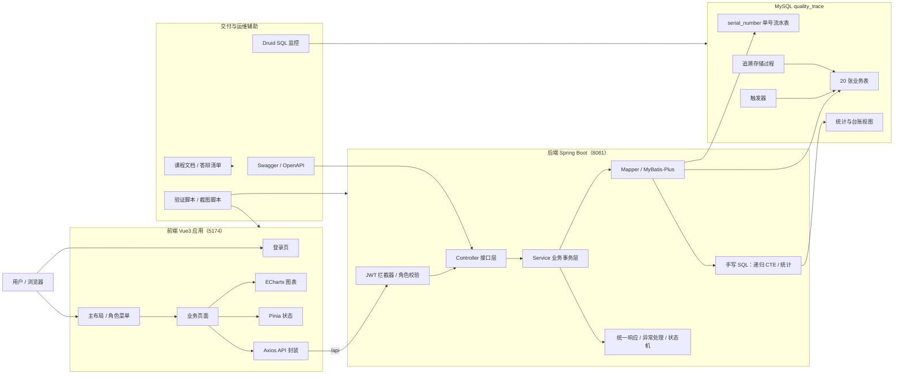
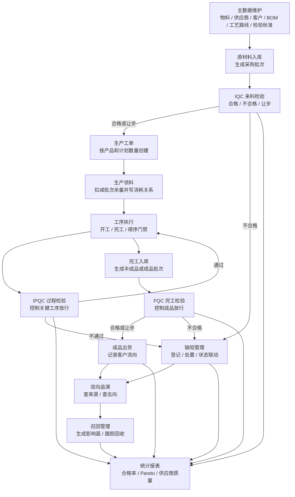
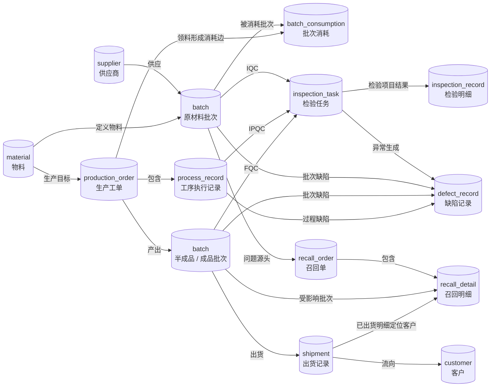
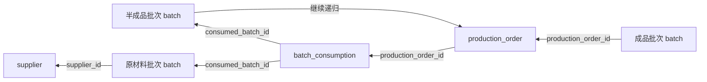
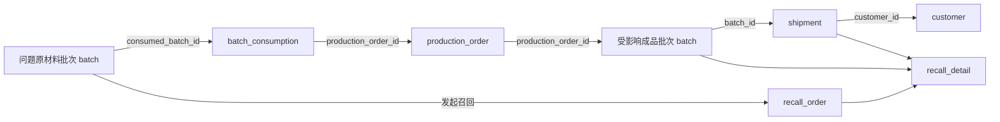
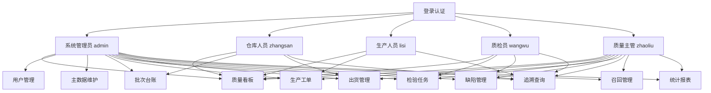

# 系统架构图 —— 产品质量追踪系统

本文档用 Mermaid 图补充说明系统整体结构、核心业务闭环和追溯数据链路，可直接用于课程报告或答辩材料。

## 1. 整体系统架构

说明：

- 前端通过 Vite 开发服务器运行在 `5174`，`/api` 请求代理到后端 `8081`。
- 后端以 Controller、Service、Mapper 分层组织，关键写操作在 Service 层使用事务。
- MyBatis-Plus 承担通用 CRUD，追溯和统计使用手写 SQL。
- MySQL 负责外键、唯一约束、触发器、视图、存储过程和单号流水。
- Swagger、Druid 和脚本用于接口说明、SQL 监控和可重复验收。

## 2. 核心业务闭环

说明：

- 追溯链在入库、领料、工序、完工入库、出货过程中自动形成。
- IQC、IPQC、FQC 分别对应来料、过程、完工三个质量控制节点。
- 缺陷处置会联动批次或工序状态，避免问题批次继续流转。
- 召回模块复用正向追溯结果生成影响面，并跟踪已出货和在库受影响批次。

## 3. 追溯数据链路

### 3.1 反向追溯

用途：从成品批次反查使用过的半成品、原材料和供应商，用于质量问题定位。

### 3.2 正向追溯

用途：从问题原料批次查找全部受影响产出批次和客户流向，用于召回影响面生成。

## 4. 权限与页面关系

说明：

- 前端侧边菜单根据当前用户角色过滤。
- 后端接口通过 JWT 和角色注解校验权限。
- 追溯查询和质量看板可作为跨角色的公共质量信息入口。

## 5. 可放入报告的简短说明

系统采用前后端分离架构。前端基于 Vue3、Element Plus 和 ECharts 构建业务界面，后端基于 Spring Boot、MyBatis-Plus 和 MySQL 实现接口、事务和数据持久化。追溯链以批次为核心，`batch_consumption` 表记录生产领料形成的物料消耗边，`production_order` 表连接投入批次与产出批次，`shipment` 表记录成品客户流向，`recall_order` 与 `recall_detail` 表记录召回影响面和回收状态。系统通过递归 CTE 支持批次双向追溯，通过外键、唯一约束、状态机、触发器和事务保证质量数据的一致性与可追责性。

